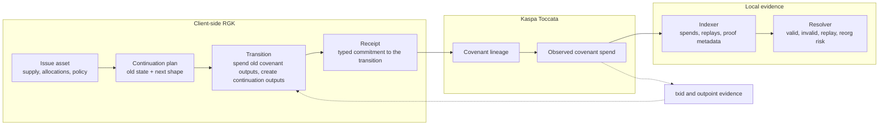
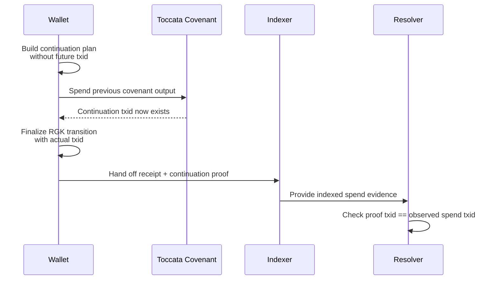
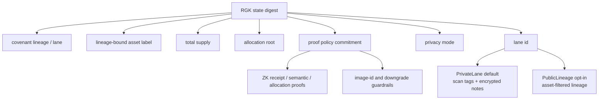

# RGK - Really Good Kaspa

RGK is a Kaspa-native covenant-lineage asset system.

It lets wallets issue and move assets while Kaspa Toccata covenants anchor the
lineage on chain. The chain proves that a covenant spend happened in the right
place; RGK clients verify what that spend means for the asset.

RGK is not a compatibility layer. Its canonical asset identity is the Kaspa
covenant lineage / lane. `asset_id` is native label material committed into
that lineage, not an external contract id or the primary identity.

## The Short Version

* Asset state is validated by clients, not reconstructed from public chain data.
* Asset identity is the covenant lineage / lane; `asset_id` is lineage-bound
  label material.
* Toccata covenants preserve the lineage and output shape that RGK expects.
* Receipts bind the validated asset transition to the covenant spend.
* The indexer records observed chain evidence.
* The resolver only reports a valid state when the receipt, continuation proof,
  and observed spend agree.
* Private lanes are the default. Public lineage is opt-in.

## How RGK Works

At a high level, RGK splits responsibility between the wallet and Kaspa:



The important point is that a transaction alone is not an RGK transfer. A valid
transfer needs both pieces:

* a native RGK transition that passes asset rules, and
* chain evidence that the matching covenant spend actually happened.

### Two-Phase Continuation Output

RGK has to commit to the next output before the future transaction id exists.
That would normally be circular, so the continuation output is built in two
phases.



If the continuation proof is missing, or if the indexed continuation outpoint
does not match the spend seen on chain, the resolver rejects the transition.

### State, Privacy, And Proofs

RGK state is a set of commitments. For private lanes, observers should see
opaque values; wallets with the right view key can discover their own lane.



Proof policy is part of state. A wallet cannot silently swap in an unconstrained
verifier image id later; that would change the committed state and be rejected.

## Try It

Fixture mode needs no Kaspa node:

```bash
./scripts/e2e-local.sh
```

For a live local Toccata run:

```bash
./scripts/setup-external.sh
./scripts/build-kaspa.sh
./scripts/run-kaspa-local.sh --background
./scripts/e2e-local.sh --live
```

For local devnet evidence:

```bash
./scripts/e2e-devnet.sh --start-kaspa
```

`setup-external.sh` only clones the Kaspa Toccata repository used by the local
covenant and devnet evidence scripts.

## What Is Implemented

The native path is in place:

* `RgkAssetIssue` defines asset supply, allocations, proof policy, privacy
  policy, metadata and owner commitments, and lane id.
* `RgkContinuationPlan` binds the previous allocation set and next output shape
  before the continuation txid exists.
* `RgkTransition` finalizes the plan after the txid exists, spends old
  covenant outputs, creates new allocation outputs, and binds ordered inputs,
  ordered outputs, policy, privacy mode, lane id, and witness txid.
* `RgkReceipt` carries the typed statement consumed by the covenant, indexer,
  and resolver.
* `RgkResolver` classifies live evidence as valid, invalid, replayed, competing,
  unconfirmed, or at reorg risk.
* Wallet allocation strategy planning selects fixed allocation-vector proofs for
  evidenced shapes or segmented allocation-audit certificates for larger
  conserving full-state transfers, with native strategy commitments, canonical
  strategy-record handoff bytes, and fail-closed burn/empty-side checks.

The ZK and audit surface is evidence-backed for the shapes currently claimed:

* receipt and semantic transition statements,
* lane discovery and segmented private-lane graph proofs,
* terminal `1x0` burn plus `1x1`, `2x2`, `3x2`, `4x2`, and `4x4` allocation
  vector proofs,
* segmented allocation transcript, conservation, final equality, and exclusion
  proofs,
* allocation audit bundle and canonical allocation audit certificate handoff.

The examples matrix tracks the maintained coverage surface:

```bash
bash scripts/verify-example-matrix.sh
```

Public testnet/mainnet staging is still gated on a funded public run and a
verified report. RGK also does not claim one recursive proof for arbitrary-size
allocation vectors; larger conserving full-state transfers use segmented audit
certificates.

The launch readiness verifier covers internal-readiness, local/devnet,
public-staging preflight, and optional funding-readiness gates. Strict mode
remains non-zero until the funded public testnet report verifies.

## Repository Map

| Path | What lives there |
| --- | --- |
| `crates/rgk-core` | Canonical RGK wire types and commitments |
| `crates/rgk-receipt` | Receipt builder and verifier |
| `crates/rgk-covenant` | Toccata covenant state and script builder |
| `crates/rgk-kaspa` | Chain backend trait and live wRPC backend |
| `crates/rgk-asset` | Native RGK asset grammar |
| `crates/rgk-zk` | ZK statement encoding, Groth16 receipt path, and Toccata R0 Succinct stack material |
| `crates/rgk-indexer` | In-memory and sled indexers |
| `crates/rgk-sync` | Restart-safe scanner service |
| `crates/rgk-resolver` | Native state reconstruction |
| `crates/rgk-tx` | Unsigned builders plus Toccata v1 transaction, Borsh wire, and hash boundary |
| `tests/rgk-e2e` | Fixture and live e2e harness |
| `scripts` | Kaspa setup, local node, devnet, and e2e scripts |
| `docs` | Architecture, specs, security notes, and runbooks |

## Quality Checks

For a focused protocol change, start with:

```bash
cargo fmt --all -- --check
cargo test -p rgk-asset
cargo test -p rgk-e2e --lib
cargo clippy -p rgk-asset --all-targets --all-features -- -D warnings
```

Before calling a release or launch path healthy, run the broader gates:

```bash
cargo test --workspace --no-default-features
cargo test --workspace --all-features
RUSTDOCFLAGS='-D warnings' cargo doc --workspace --all-features --no-deps
bash scripts/e2e-privacy-observer.sh
bash scripts/verify-privacy-observer-evidence.sh
bash scripts/e2e-internal-readiness.sh
bash scripts/verify-internal-readiness-evidence.sh
bash scripts/verify-silverscript-artifacts.sh
bash scripts/verify-example-matrix.sh
./scripts/e2e-devnet.sh --start-kaspa
bash scripts/verify-launch-readiness.sh --allow-blocked
```

## Further Reading

* `docs/ARCHITECTURE.md` - system boundaries and data flow
* `docs/LANE-CALCULUS.md` - asset, lane, privacy, and continuation model
* `docs/RECEIPT-SPEC.md` - receipt wire format
* `docs/COVENANT-SPEC.md` - covenant state and script contract
* `docs/ZK-BOUNDARY.md` - what the ZK path proves
* `docs/ZK-PROOF-PLAN.md` - proof-path planning, cost budgets, and VK governance
* `docs/SECURITY.md` - threat model and trust assumptions
* `docs/VERIFICATION-BUDGET.md` - bounded verification costs
* `docs/E2E.md` - local and devnet runbook
* `docs/INTEGRATION.md` - wallet integration shape
* `docs/MAINNET-LAUNCH.md` - public-network launch gates

## License

MIT.
