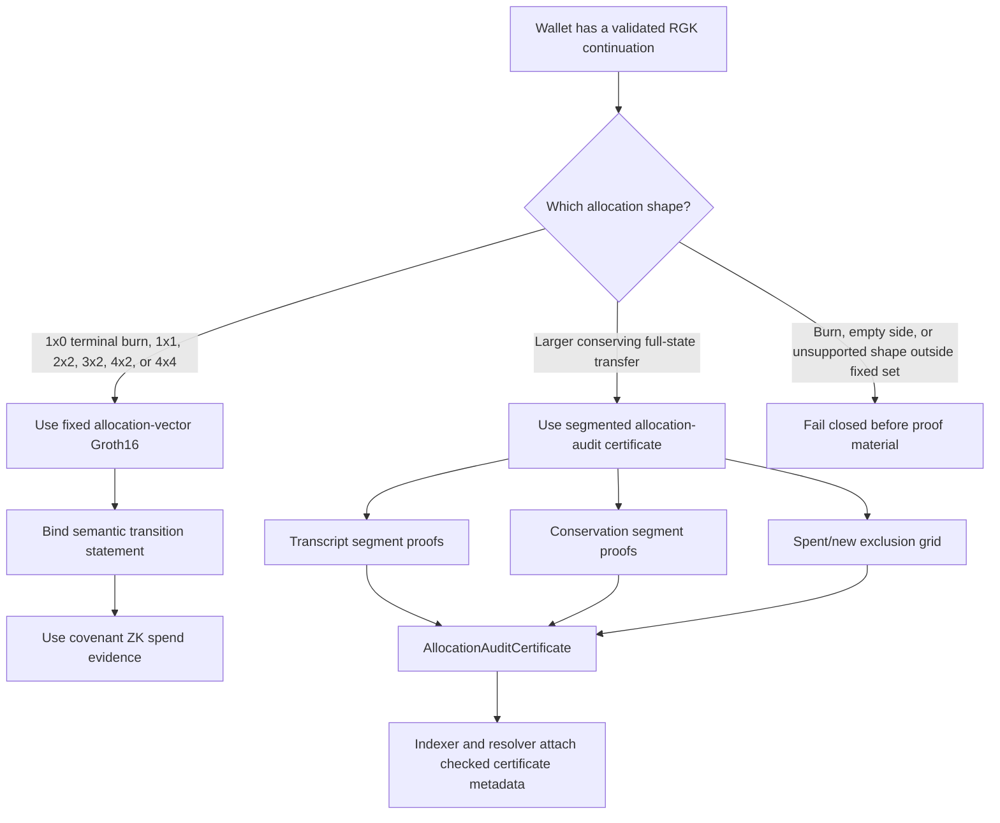
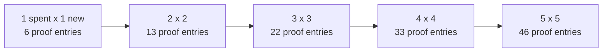
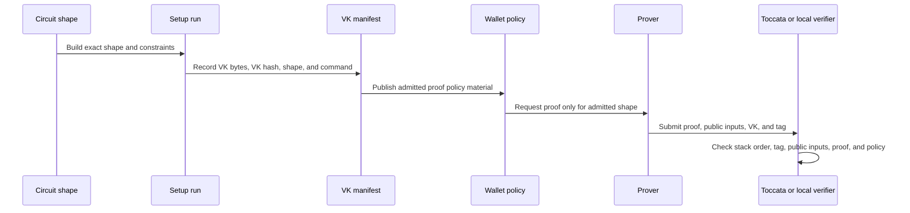

# ZK Proof Plan

This document is the plain-language plan for RGK proof work. It explains which
proofs are production-shaped today, which proofs are only evidence or support
material, and where cost can grow if we are not careful.

The short version:

* Use fixed Groth16 allocation proofs whenever the transfer shape is one of the
  evidenced shapes.
* Use segmented allocation-audit certificates for larger conserving full-state
  transfers.
* Do not describe segmented audit as one recursive proof.
* Do not put R0 Succinct on the hot path until RGK has a native RISC0 prover,
  circuit family, and cost evidence.
* Keep every proof claim tied to a verifier, a shape, a cost budget, and a
  report line that proves it.

## Current Claim Boundary

RGK currently has these proof surfaces:

| Surface | Current status | Production claim |
| --- | --- | --- |
| Covenant ZK spend | Live in devnet and public testnet evidence | Supported for the current covenant spend path |
| Semantic transition Groth16 | Live evidence | Supported as a bounded statement proof |
| Fixed allocation-vector Groth16 | Live for evidenced shapes | Supported only for the registered fixed shapes |
| Segmented allocation audit | Live as a proof bundle and certificate | Supported as handoff/resolver evidence, not as one recursive proof |
| Lane discovery and lane graph proofs | Live evidence | Supported for bounded discovery shapes and segmented graph chains |
| R0 Succinct stack | Upstream VM fixture support | Stack support only; not a native RGK RISC0 proof system |

Do not claim:

* one proof for arbitrary-size allocation transitions
* one recursive proof for arbitrary-size private-lane graph discovery
* native RISC0 proving for RGK statements
* proof cost that has not been measured in a current evidence run
* mainnet economics from testnet proof-size evidence

## Proof Path Selector

Wallet and prover code should choose the proof path before constructing proof
material. Unsupported paths fail before setup or proving.



## Current Cost Snapshot

These numbers are from current RGK evidence reports. They are useful planning
figures, not a mainnet fee promise.

| Proof path | Public inputs | VK bytes | Proof bytes | Notes |
| --- | ---: | ---: | ---: | --- |
| Covenant ZK spend | 29 | 1192 | 128 | Public testnet covenant spend path |
| Semantic transition | 64 | 2312 | 128 | 512-byte native statement packed into BN254 fields |
| Fixed allocation-vector | 64 | 2312 | 128 | Same public input shape for evidenced fixed arities |
| Allocation transcript segment | 16 each | 776 | 128 each | Per side and segment |
| Allocation conservation segment | 24 each | 1032 | 128 each | Per side and segment |
| Allocation conservation final | 10 | 584 | 128 | One final equality proof |
| Allocation exclusion pair | 29 | 1192 | 128 | One spent/new segment pair |
| Current allocation audit certificate | n/a | 5392 total | 768 total | 6 proof entries, 11826 canonical bytes |
| Lane discovery | 9 | 552 | 128 | Bounded private-lane discovery |
| Lane graph discovery | 22 | 968 | 128 | Current 2-node graph |
| Segmented lane graph | 27 each | 1128 | 128 each | Per graph segment |
| R0 Succinct fixture | n/a | n/a | 222668 seal bytes | Upstream VM fixture only |

The important part is not just proof size. The expensive pieces are:

* setup and proving time for allocation circuits
* verification key bytes carried into the Toccata precompile stack
* public-input stack items
* number of proof entries in segmented audit
* wallet UX latency when proving is done synchronously

## Segmented Audit Cost Growth

Segmented audit is intentionally bounded, but it is not constant cost. With
two-allocation segments, the proof-entry count is:

```text
2 * (spent_segments + new_segments) + 1 + spent_segments * new_segments
```

That means the exclusion grid becomes the growth driver.



Use segmented audit when it is the right handoff format for a larger full-state
transfer. Do not use it as a cheap replacement for fixed allocation proofs.

## Production Budget Rules

The proof planner should enforce these rules before proof construction:

| Rule | Required behaviour |
| --- | --- |
| Fixed shape is supported | Use the fixed allocation-vector proof path |
| Fixed shape is unsupported but transfer is conserving and full-state | Use segmented allocation audit |
| Transfer burns supply outside a supported fixed burn shape | Fail closed |
| Either allocation side is empty outside a supported fixed shape | Fail closed |
| Segment count exceeds the configured wallet/prover budget | Fail closed |
| Certificate canonical bytes exceed the configured transport budget | Fail closed |
| Proof policy does not admit the verifier key or image id | Fail closed |
| R0 Succinct proof is requested as a normal RGK receipt proof | Fail closed |

Open budget parameters to freeze before mainnet:

* maximum proof entries per allocation-audit certificate
* maximum certificate canonical bytes
* maximum Toccata script bytes for each live proof stack
* maximum wallet-side proving latency for interactive flows
* maximum background proving latency for batch flows
* minimum testnet/mainnet funding envelope for real-ZK staging

## Verifier Key Governance

Every proof shape needs a clear key lifecycle. A verifier key is part of the
security boundary, not an implementation detail.



Before mainnet, RGK should decide:

* whether Groth16 setup is reproducible-only or ceremony-backed
* where VK hashes are pinned
* how VK manifests are versioned
* how old VKs are retired
* how policy migration admits a new verifier key
* which command regenerates each VK and proof fixture

## Operational Evidence

The following commands are the current evidence gates:

```sh
bash scripts/e2e-internal-readiness.sh
bash scripts/verify-internal-readiness-evidence.sh target/rgk-internal-readiness/latest.txt
bash scripts/e2e-testnet-staging.sh --resume target/rgk-testnet-staging-evidence/latest.txt
bash scripts/verify-testnet-staging-evidence.sh target/rgk-testnet-staging-evidence/latest.txt
bash scripts/verify-launch-readiness.sh
```

The evidence must keep reporting:

* public inputs, VK bytes, and proof bytes for live proof stacks
* allocation-audit proof-entry count
* allocation-audit canonical byte length
* R0 Succinct fixture size when that support is discussed
* resolver acceptance and persistent indexer recovery

## Planning Tracks

### P0: Keep Current Production Claims Honest

* Keep fixed allocation proof support restricted to evidenced shapes.
* Keep segmented audit described as a bundle/certificate, not a recursive proof.
* Keep R0 Succinct described as stack support, not native RGK RISC0 proving.
* Fail closed before proof construction when the strategy selector rejects a
  shape.

### P1: Freeze Mainnet Budgets

* Add explicit maximums for proof entries, certificate bytes, script bytes, and
  proof latency.
* Publish a verifier-key manifest for each production shape.
* Add a budget verifier that fails when current evidence exceeds the frozen
  limits.
* Decide whether wallets may perform fixed allocation proving synchronously or
  must delegate/background it.

### P2: Future Compression Work

* Recursive aggregation for arbitrary-size allocation conservation.
* Recursive aggregation for spent-output reuse exclusion.
* Native RGK RISC0 prover and circuit family.
* Proof compression or VK registry support if Toccata economics require it.
* A larger private-lane graph strategy if segmented graph chains become too
  costly for wallet UX.

## Plain-Language Decision Rule

If one fixed Groth16 proof can prove the transition, use it. If the state is too
large but still conserving, use segmented audit and be honest that it is a
bundle. If the transfer needs an unsupported burn, empty side, arbitrary
recursive proof, or native RISC0 claim, do not produce proof material yet.
