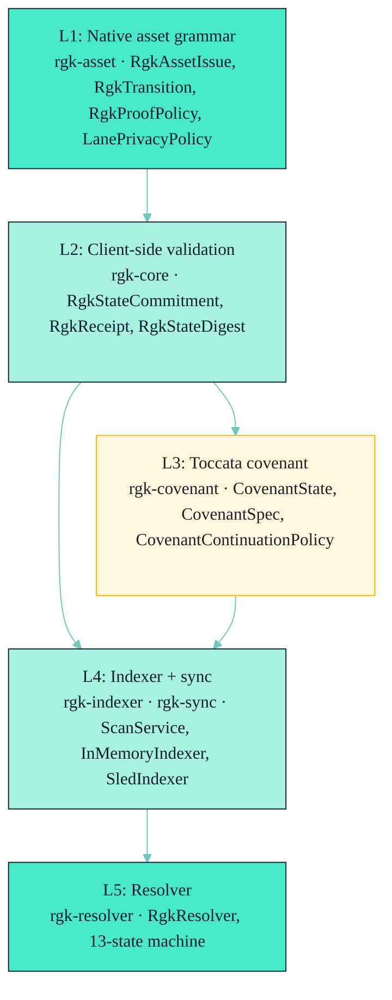

# Concepts / Architecture

> **RGK is a layered Kaspa-native covenant-lineage asset system.** Five
> layers, eleven crates plus `rgk-walletd`, one resolver state machine.

This page is a tutorial-flavored summary of
[`docs/ARCHITECTURE.md`](../../ARCHITECTURE.md). It fixes one drift item:
the official `ARCHITECTURE.md` crate list omits `rgk-walletd`. The wiki
includes it.

---

## The Five Layers



| Layer | Responsibility | Crates |
| --- | --- | --- |
| L1 — Native asset grammar | Issue, transfer, ownership, proof policy, privacy. | `rgk-asset` |
| L2 — Client-side validation | Canonical wire types, domain-separated commitments, receipts. | `rgk-core`, `rgk-receipt`, `rgk-zk` |
| L3 — Toccata covenant | Covenant state, script builder, continuation policy. | `rgk-covenant`, `rgk-tx` |
| L4 — Indexer + sync | Restart-safe scanner, replay-protected index, observed-spend store. | `rgk-indexer`, `rgk-sync` |
| L5 — Resolver | Native state reconstruction, 13-variant classification. | `rgk-resolver` |

The chain backend (L0) is `rgk-kaspa` (the trait surface) plus the `wrpc`
feature for live Kaspa nodes. The daemon (`rgk-walletd`) sits on top of all
five layers.

---

## The 12 Crates (this time, including `rgk-walletd`)

| Crate | Lines | What it owns |
| --- | --- | --- |
| `rgk-core` | ~65 | Canonical wire types, domain-separated commitments. |
| `rgk-asset` | ~90 (re-exports) + `native.rs` 5237 lines | Native asset grammar + lane privacy + commitment markers. |
| `rgk-receipt` | ~684 | Build / verify a native RGK receipt. |
| `rgk-covenant` | ~2154 | Toccata covenant state + script + advanced policy/execution. |
| `rgk-tx` | ~1709 | Pure unsigned tx builders + Toccata v1 wire boundary. |
| `rgk-zk` | ~1167 | ZK statement, Groth16 precompile integration, R0 Succinct stack material. |
| `rgk-kaspa` | ~667 | Trait surface for any Kaspa node + wRPC backend. |
| `rgk-indexer` | ~3078 | Replay-safe RGK state + scan cursors + observed spends. |
| `rgk-resolver` | ~1516 | End-to-end native resolver state machine. |
| `rgk-sync` | ~568 | Restart-safe scanner driver. |
| `rgk-walletd` | (single main.rs) | Local Avato HTTP wallet daemon. |
| `tests/rgk-e2e` | (test crate) | Fixture + live harness. |

> **Drift note:** the canonical `docs/ARCHITECTURE.md` lists 10 crates;
> this wiki adds `rgk-walletd` and the e2e test crate. The
> `audits/public-api-surface.md` table predates `rgk-walletd` and lists
> 11; treat that audit as covering the original surface.

---

## Transition Flow

A native RGK transition flows through every layer. The 7-step narrative
from [`docs/ARCHITECTURE.md` §Transition Flow](../../ARCHITECTURE.md):

1. **Wallet** builds a `RgkContinuationPlan` (phase 1) from the previous
   issue + new allocation shapes.
2. **Wallet** calls `RgkContinuationPlan::into_production_zk_transfer_plan`
   (if production-ZK), which selects a `RgkAllocationProofShape` and
   wraps the plan.
3. **Wallet** signs and broadcasts the covenant spend. The covenant
   enforces the phase-1 commitment as a witness.
4. **Wallet** calls `RgkContinuationPlan::finalize(witness_txid, daa, depth)`
   → `RgkFinalizedContinuation` (phase 2).
5. **Wallet** builds the `RgkReceipt` from the receipt input + transition
   digest + continuation commitment.
6. **Indexer** records the spend with `apply_spend_with_continuation(...)`.
7. **Resolver** classifies: `Open` → `ReorgRisk` → `NativeTransitionedValid`
   (after `depth >= reorg_safety_depth`).

The witness txid is bound into the phase-2 transition; the continuation
commitment is bound into the receipt and the covenant script; the receipt
id is bound into the indexer's replay set. Three independent commitments,
one shared truth.

---

## Lane Model

Private lanes carry per-state material:

| Field | What it is | Source |
| --- | --- | --- |
| `BlindedLaneId` | `H(view_key, asset_id, epoch)` | [`crates/rgk-asset/src/native.rs:770`](../../crates/rgk-asset/src/native.rs) |
| `RgkScanTag` | `H(view_key, lane_id, epoch)`; rotates per epoch | [`crates/rgk-asset/src/native.rs:749`](../../crates/rgk-asset/src/native.rs) |
| `RgkNullifier` | `H(spend_secret, covenant_anchor)`; stable for the spend, unlinked to lane_id | [`crates/rgk-asset/src/native.rs:759`](../../crates/rgk-asset/src/native.rs) |
| `RgkPolicyCommitment` | `RgkProofPolicy::commitment()` | [`crates/rgk-asset/src/native.rs:509`](../../crates/rgk-asset/src/native.rs) |
| `RgkPrivateStateRoot` | Per-lane graph root, see `rgk:lane:graph-root:v1` | [`docs/LANE-CALCULUS.md`](../../LANE-CALCULUS.md) |
| Encrypted note | Holder-only payload (not committed to chain) | wallet-side |
| View key | Holder-side secret; never on chain | wallet-side |

Public-lineage lanes are a strict subset: they expose the lineage id and
the lane history but still commit to the same set of primitives.

---

## Resolver States (the 13 outcomes)

Inline (lifted from `crates/rgk-resolver/src/lib.rs:42-108`):

```rust
pub enum ResolverState {
    Open { covenant, outpoint, state },
    NativeTransitionedValid {
        covenant, spent_outpoint, new_outpoint,
        receipt_id, new_state, allocation_audit_certificate,
        confirmation_depth,
    },
    NativeTransitionedInvalid { covenant, reason },
    Unconfirmed { covenant, spending_txid },
    ReorgRisk { covenant, daa_score },
    CompetingBranch {
        covenant, spent_outpoint,
        indexed_spending_txid, observed_spending_txid, observed_daa_score,
    },
    PolicyMigrationRequired { covenant, current_policy, requested_policy },
    ReplayRejected { covenant, receipt_id },
    Unknown { covenant },
    NodeDown { covenant, reason },
}
```

Plus:

- `LaneResolverState` (`Resolved { lane, state }`, `UnknownLane`,
  `UnknownScanTag`).
- `TransitionResolverState` (`Resolved { transition_digest, covenant,
  receipt_id, state }`, `UnknownTransition`).

See [Concepts / Resolver](./Resolver.md) for the worked treatment.

The lane-specific resolver entry points
([`crates/rgk-resolver/src/lib.rs:412-457`](../../crates/rgk-resolver/src/lib.rs)):

- `resolve_lane(lane_id) -> LaneResolverState`
- `resolve_by_view_key(view_key, asset_id, epoch) -> LaneResolverState`
- `resolve_by_scan_tag(scan_tag) -> LaneResolverState`
- `resolve_public_lineage(asset_id) -> Vec<LaneResolverState>` (filtered to
  `lane.public_lineage == true`)

Policy migration is gated by `PolicyMigrationInput::build` in `rgk-core`
and applied via
`Indexer::apply_spend_with_continuation_and_policy_migration`.

---

## The ZK Boundary

This page does not retell the ZK path in detail — see
[Concepts / Production Allocation Strategy](./Production-Allocation-Strategy.md)
and [Reference / ZK Boundary](../Reference/ZK-Boundary.md). The
short version:

- Receipt statement (232 bytes / 29 fields).
- Semantic transition statement (512 bytes / 64 fields).
- Lane discovery / lane graph / segmented lane graph (Groth16).
- Allocation-vector circuits (1×0, 1×1, 2×2, 3×2, 4×2, 4×4).
- Segmented audit (transcript, conservation, conservation-final, exclusion).
- `AllocationAuditBundle` verifier + `AllocationAuditCertificate` envelope
  (`rgk:zk:allocation-audit-certificate:v1`, `rgk:aac1`).
- `R0SuccinctPrecompileStack` (stack support only; **not** a native RISC0
  prover).

---

## Cross-references

- [`docs/ARCHITECTURE.md`](../../ARCHITECTURE.md) — the canonical doc.
- [`docs/RECEIPT-SPEC.md`](../../RECEIPT-SPEC.md) — receipt invariants.
- [`docs/COVENANT-SPEC.md`](../../COVENANT-SPEC.md) — covenant payload.
- [`docs/LANE-CALCULUS.md`](../../LANE-CALCULUS.md) — lane calculus.
- [`docs/ZK-BOUNDARY.md`](../../ZK-BOUNDARY.md) — ZK surface.
- [Concepts / Identity](./Identity.md) — lineage first, label second.
- [Concepts / Continuation](./Continuation.md) — two-phase model.
- [Concepts / Resolver](./Resolver.md) — 13-state machine.