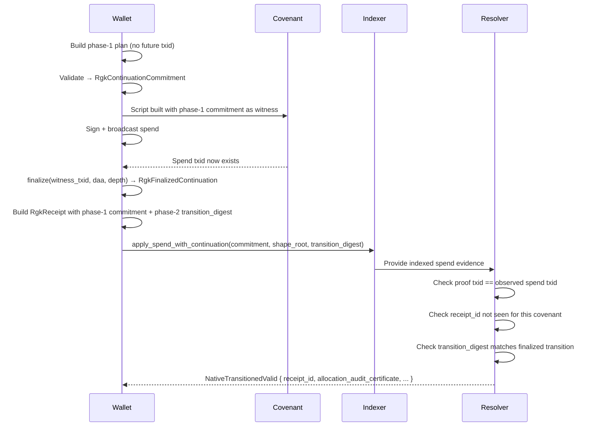

# Concepts / Continuation

!!! info "TL;DR"
    RGK needs to commit to the next covenant output's shape **before** the
    spending transaction exists. Two phases solve this: **Phase 1** builds
    an `RgkContinuationPlan` whose commitment is stable across re-plans, and
    **Phase 2** calls `finalize(witness_txid, daa, depth)` to bind the actual
    txid into the transition. The resolver enforces that both commitments
    agree with the observed spend.

> **The two-phase continuation model is what lets RGK bind the next output
> shape before the future transaction id exists.**

This page explains *why* two phases are needed, what each phase commits to,
and what the resolver rejects if either phase is missing or mismatched.

---

## The Chicken-and-Egg at a Glance

```mermaid
%%{init: {'theme': 'base', 'themeVariables': {
  'primaryColor': '#49eacb', 'primaryTextColor': '#0a1f2e',
  'primaryBorderColor': '#112233', 'lineColor': '#70C7BA',
  'fontFamily': 'Inter, system-ui, sans-serif'
}}}%%
flowchart LR
    P["Phase 1<br/>RgkContinuationPlan<br/>(no txid yet)"] -- "validates to" --> C["RgkContinuationCommitment<br/>stable across re-plans"]
    S["Sign + broadcast"] --> T["witness_txid now exists"]
    T --> F["Phase 2<br/>finalize(witness_txid, daa, depth)"]
    F --> R["RgkFinalizedContinuation<br/>(commitment + transition + report)"]
    C --> S
    S --> T

    style P fill:#49eacb,stroke:#112233,color:#0a1f2e
    style F fill:#fff8e1,stroke:#FFB300,color:#231F20
    style R fill:#49eacb,stroke:#112233,color:#0a1f2e
    style C fill:#fff8e1,stroke:#FFB300,color:#231F20
```



The phase-1 commitment is what gets baked into the covenant script and
the receipt; the phase-2 transition is what binds the actual txid. The
resolver checks both against the observed spend.

---

## The Chicken-and-Egg Problem

A native RGK transfer is a **covenant spend** that creates a new covenant
output (the *continuation output*). The new output is the next step in the
lineage. But:

- The next output's `covenant_id` depends on its script.
- The script depends on the **new asset state** (allocations, supply,
  policy).
- The new asset state is the *result* of the transfer.

If the wallet has to commit to the new state inside the spend, it has to
know the spend's txid — which doesn't exist yet. This is the classic
"circular dependency" that client-side validation systems have to navigate.

RGK solves it with two phases:

| Phase | Wallet has… | Wallet commits to… | Witness needed? |
| --- | --- | --- | --- |
| **Phase 1: Plan** | Previous state + next output **shapes** | The continuation commitment (`RgkContinuationCommitment`) | **No.** Stable across re-plans. |
| **Phase 2: Finalize** | The actual witness txid + daa score + confirmation depth | The full `RgkTransition` (with allocations anchored to the witness txid) | **Yes.** Different txid → different transition digest. |

The proof that phase 1 is stable without the future txid:
[`crates/rgk-asset/src/native.rs:4659`](../../crates/rgk-asset/src/native.rs) —
`continuation_phase1_commitment_is_stable_without_future_txid`.

The proof that phase 2 binds the actual txid:
[`crates/rgk-asset/src/native.rs:4698`](../../crates/rgk-asset/src/native.rs) —
`continuation_phase2_binds_actual_txid`.

---

## Phase 1: Plan

The wallet builds an `RgkContinuationPlan`:

```rust
// crates/rgk-asset/src/native.rs:872
pub struct RgkContinuationPlan {
    pub chain: KaspaChainId,
    pub schema_id: RgkSchemaId,
    pub asset_id: RgkAssetId,
    pub total_supply: u64,
    pub metadata_commitment: RgkMetadataCommitment,
    pub previous_owner_commitment: RgkOwnerCommitment,
    pub new_owner_commitment: RgkOwnerCommitment,
    pub ownership_authorization_commitment: Bytes32,
    pub previous_state_digest: RgkStateDigest,
    pub spent_allocations: Vec<RgkAllocation>,
    pub new_allocation_shapes: Vec<RgkContinuationAllocationShape>,  // ← shapes, not allocations
    pub burn: Option<RgkBurnProof>,
    pub lane_id: BlindedLaneId,
    pub privacy_policy: LanePrivacyPolicy,
    pub proof_policy: RgkProofPolicy,
}
```

Notice `new_allocation_shapes: Vec<RgkContinuationAllocationShape>`. A shape
is **everything about an allocation except the covenant outpoint** — the
amount, owner, lane hint, but **no txid yet**. That is the
phase-1-vs-phase-2 distinction:

| Field | Phase 1 (`RgkContinuationAllocationShape`) | Phase 2 (`RgkAllocation`) |
| --- | --- | --- |
| amount | ✓ | ✓ |
| owner commitment | ✓ | ✓ |
| lane hint | ✓ | ✓ |
| covenant outpoint | **✗ (none)** | **✓ (transaction_id, index)** |

The wallet calls `RgkContinuationPlan::validate()` — at
[`crates/rgk-asset/src/native.rs:1476`](../../crates/rgk-asset/src/native.rs) —
which returns an `RgkContinuationReport` carrying the **phase-1 commitment**:

```rust
pub commitment: RgkContinuationCommitment   // crates/rgk-asset/src/native.rs:951
```

This commitment is **stable** — call `validate()` twice and you get the
same commitment. That is the value that goes into both:

1. The `RgkReceipt.continuation_commitment` field.
2. The covenant script's continuation policy (so the chain enforces that
   the spend agrees with the plan).

---

## Phase 2: Finalize

After the wallet signs the spend and broadcasts the transaction, the
transaction id **now exists**. The wallet calls:

```rust
// crates/rgk-asset/src/native.rs:1524
RgkContinuationPlan::finalize(
    witness_txid: Bytes32,
    daa_score: u64,
    confirmation_depth: u64,
) -> Result<RgkFinalizedContinuation, RgkAssetError>
```

This produces:

```rust
// crates/rgk-asset/src/native.rs:954
pub struct RgkFinalizedContinuation {
    pub commitment: RgkContinuationCommitment,     // same as phase 1
    pub transition: RgkTransition,                  // phase-2 transition
    pub transition_report: RgkTransitionReport,     // ← the new outputs are anchored to witness_txid
}
```

The phase-2 `RgkTransition` carries `new_allocations: Vec<RgkAllocation>`
where each allocation's `RgkCovenantAnchor.covenant_outpoint.transaction_id
== witness_txid`.

The `transition_report.transition_digest` is the value the receipt's
`transition_digest` field must match — see [Reference / Receipt Spec](../Reference/Receipt-Spec.md).

---

## Why Bother With Two Phases?

Because the covenant script needs the phase-1 commitment baked in **at
script-construction time**, before the witness txid exists. If we tried to
build the script with the phase-2 transition digest, we'd be trying to
compute a hash that includes its own hash — a loop with no fixed point.

By separating the plan (phase 1) from the finalisation (phase 2), RGK gets:

| Property | Where it lives |
| --- | --- |
| The script enforces the **shape** of the continuation. | `CovenantContinuationPolicy` (`docs/COVENANT-SPEC.md`). |
| The script enforces the **phase-1 commitment** as a witness element. | `CovenantSpec::build_script_for_policy`. |
| The phase-2 transition binds the **actual txid**. | `RgkTransition::witness_txid` + `RgkCovenantAnchor`. |
| The resolver enforces that **all three** agree (commitment, transition digest, observed spend). | `RgkResolver::verify_receipt_against_indexer` (`crates/rgk-resolver/src/lib.rs:493`). |

A worked example:



If any of these checks fails, the resolver returns one of:

- `NativeTransitionedInvalid { reason }` — receipt or continuation proof
  failed structural checks.
- `ReplayRejected { receipt_id }` — receipt id already accepted.
- `ReorgRisk { daa_score }` — confirmed but `depth < reorg_safety_depth`.

See [Concepts / Resolver](./Resolver.md) for the full state machine.

---

## What Happens if Phase 1 is Missing?

If the continuation proof is missing or the indexed continuation outpoint
does not match the spend seen on chain, the resolver rejects the transition.
The relevant invariant: see `RgkResolver::verify_receipt_against_indexer`
at [`crates/rgk-resolver/src/lib.rs:493`](../../crates/rgk-resolver/src/lib.rs).

What happens if the phase-1 commitment itself tries to reuse a spent anchor?
[`crates/rgk-asset/src/native.rs:4722`](../../crates/rgk-asset/src/native.rs)
shows `continuation_replay_reusing_spent_anchor_is_rejected` — the
phase-1 commitment is not just any hash; it binds the *next* shape, and the
spent outpoint's `transaction_id` cannot appear as a future continuation
output.

---

## Worked Snippet (the smallest case)

The smallest phase-1 plan in the test suite
([`crates/rgk-asset/src/native.rs:3464`](../../crates/rgk-asset/src/native.rs)):

```rust
fn continuation_plan() -> RgkContinuationPlan {
    let issue = issue();
    let previous_report = issue.validate().unwrap();
    RgkContinuationPlan {
        chain: issue.chain,
        schema_id: issue.schema_id,
        asset_id: issue.asset_id,
        total_supply: issue.total_supply,
        metadata_commitment: issue.metadata_commitment,
        previous_owner_commitment: issue.owner_commitment,
        new_owner_commitment: issue.owner_commitment,
        ownership_authorization_commitment: [0; 32],
        previous_state_digest: previous_report.state_digest,
        spent_allocations: issue.allocations,
        new_allocation_shapes: continuation_shapes(),
        burn: None,
        lane_id: issue.lane_id,
        privacy_policy: issue.privacy_policy,
        proof_policy: issue.proof_policy,
    }
}
```

The corresponding phase-2 test
([`crates/rgk-asset/src/native.rs:4670`](../../crates/rgk-asset/src/native.rs)):

```rust
let plan = continuation_plan();
let finalized = plan.finalize([0x88; 32], 20_000, 3).unwrap();
assert_eq!(
    finalized.transition.new_allocations[0]
        .anchor
        .covenant_outpoint
        .transaction_id,
    [0x88; 32]
);
```

Note `finalize(witness_txid=[0x88; 32], daa_score=20_000, depth=3)` — the
`3` matches the indexer-side `apply_spend_with_continuation(... daa_score=2)`
plus 1 in many tests. See
[`tests/rgk-e2e/src/lib.rs:657`](../../tests/rgk-e2e/src/lib.rs) for the
full apply_spend path.

---

## Cross-references

- [`docs/LANE-CALCULUS.md` §Two-Phase Continuation Output](../../LANE-CALCULUS.md).
- [`docs/COVENANT-SPEC.md` §Script Invariants](../../COVENANT-SPEC.md).
- [`docs/ARCHITECTURE.md` §Transition Flow](../../ARCHITECTURE.md).
- [Concepts / Identity](./Identity.md) — how lineage_id stays stable
  across phases.
- [Concepts / Resolver](./Resolver.md) — what happens when a phase
  mismatches.
- [Tutorial-2: Build, Verify, and Resolve a Receipt](../Tutorials/Tutorial-2-Receipts.md).
- [Tutorial-3: Integrate a Wallet](../Tutorials/Tutorial-3-Integrate-A-Wallet.md).