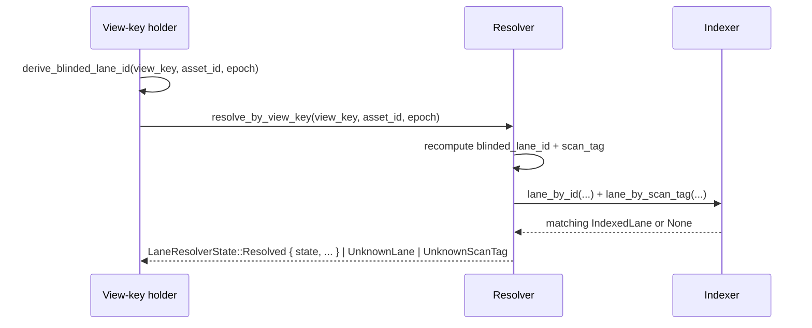

# Concepts / Privacy

> **Private by default. The default variant is `PrivateLane`.**
> `PublicLineage` is opt-in. `StealthLane` is reserved but not yet wired
> end-to-end.

This page explains the three `LanePrivacyPolicy` variants, what each one
reveals to public observers, and the gotcha about `StealthLane` being a
"dead variant" today.

---

## The Three Variants

Source: [`crates/rgk-asset/src/native.rs:424-430`](../../crates/rgk-asset/src/native.rs).

```rust
#[derive(...)]
pub enum LanePrivacyPolicy {
    PublicLineage,
    #[default]
    PrivateLane,
    StealthLane,
}
```

`LanePrivacyPolicy` is also re-exported as `RgkPrivacyPolicy` at
[`crates/rgk-asset/src/native.rs:446`](../../crates/rgk-asset/src/native.rs):

```rust
pub type RgkPrivacyPolicy = LanePrivacyPolicy;
```

The on-the-wire tag value
([`crates/rgk-asset/src/native.rs:432-439`](../../crates/rgk-asset/src/native.rs)):

| Variant | Tag (`as_u8`) | `exposes_public_fields()` |
| --- | --- | --- |
| `PublicLineage` | `0` | `true` |
| `PrivateLane` | `1` | `false` |
| `StealthLane` | `2` | `false` |

The `exposes_public_fields()` predicate is what the indexer / resolver use
to decide whether a lane is observable without a view key.

---

## What an Outside Observer Sees

The privacy-observer evidence script
([`scripts/e2e-privacy-observer.sh`](../../scripts/e2e-privacy-observer.sh))
produces the canonical answer. The static labels it emits:

```text
privacy_observer_default=PrivateLane
privacy_observer_learns=blinded_lane_ids,rotating_scan_tags,nullifiers,opaque_commitments
privacy_observer_does_not_learn=asset_id,owner,amount,lane_graph,plaintext_proof_policy
privacy_observer_view_key_required=true
privacy_observer_public_lineage_opt_in=true
```

Per variant:

| Variant | What the observer sees | What they don't see |
| --- | --- | --- |
| `PublicLineage` | `covenant_id`, `asset_id`, `lineage_id`, lane history, allocations, supply, policy commitments. | (this variant is opt-in disclosure — nothing is hidden). |
| `PrivateLane` | `blinded_lane_id`, `scan_tag` (rotates per epoch), `nullifier`, opaque commitments, the `RgkStateCommitment::state_digest`. | `asset_id`, owner, amount, lane graph, plaintext proof policy, full allocation set. |
| `StealthLane` | Same as `PrivateLane` (opaque). | Same as `PrivateLane`. The on-chain form has not been specialised yet. |

---

## The Default Is `PrivateLane`

If you build an `RgkAssetIssue` and don't specify `privacy_policy`, you get
`PrivateLane`. This is enforced by `#[default]` on the enum variant. Two
implications:

1. **No surprises.** New issues are private by default. If you want public
   lineage, you must say so explicitly.
2. **No silent disclosure.** A test that asserts
   `LanePrivacyPolicy::default() == LanePrivacyPolicy::PrivateLane` will
   catch any future regression where someone changes the default.

The full test is at
[`crates/rgk-asset/src/native.rs:5156`](../../crates/rgk-asset/src/native.rs):
`private_lane_public_observer_boundary_is_commitment_only`.

---

## How a Holder Discovers Their Lane

The view-key holder does **not** see all lanes — only their own. The
discovery primitives
([`docs/LANE-CALCULUS.md` §Discovery](../../LANE-CALCULUS.md)):

| Function | What it does | Source |
| --- | --- | --- |
| `derive_blinded_lane_id(view_key, asset_id, epoch) -> BlindedLaneId` | Recompute the lane id from the holder's view key. | [`crates/rgk-asset/src/native.rs:770`](../../crates/rgk-asset/src/native.rs) |
| `discover_lane(view_key, asset_id, epoch, candidate) -> bool` | Test whether a candidate lane id matches the holder's view key. | [`crates/rgk-asset/src/native.rs:782`](../../crates/rgk-asset/src/native.rs) |
| `RgkScanTag::derive(view_key, lane_id, epoch) -> RgkScanTag` | Derive the rotating scan tag for this epoch. | [`crates/rgk-asset/src/native.rs:749`](../../crates/rgk-asset/src/native.rs) |
| `RgkNullifier::derive(spend_secret, covenant_anchor) -> RgkNullifier` | Derive the per-spend nullifier. | [`crates/rgk-asset/src/native.rs:759`](../../crates/rgk-asset/src/native.rs) |
| `RgkResolver::resolve_by_view_key(view_key, asset_id, epoch)` | Resolver-side discovery. | [`crates/rgk-resolver/src/lib.rs:419`](../../crates/rgk-resolver/src/lib.rs) |

The flow:



The `epoch` is the rotation boundary. A scan tag is valid for one epoch;
the next epoch derives a different one. This is what prevents passive
observers from linking two spends in different epochs without the view key.

---

## Public Lineage: When to Opt In

`PublicLineage` is the right choice when:

- The asset is intended to be **publicly visible** (an exchange-listed
  stablecoin, an NFT collection, a community token).
- Holders want explorers and block explorers to be able to display
  balances and history.
- Compliance requirements demand on-chain auditability of the lineage.

The opt-in is at issue time: `LanePrivacyPolicy::PublicLineage`. To make
the indexer agree, the lane must be registered with
`IndexedLane::new(..., public_lineage: true, ...)` —
[`crates/rgk-indexer/src/lib.rs:101`](../../crates/rgk-indexer/src/lib.rs).
The resolver filters public-lineage lookups via
`resolve_public_lineage(asset_id)` at
[`crates/rgk-resolver/src/lib.rs:451`](../../crates/rgk-resolver/src/lib.rs).

The matching test:
`resolve_public_lineage_returns_only_public_lanes_for_asset` (search in
`crates/rgk-resolver/src/lib.rs` for the test name).

A worked snippet from the e2e
([`tests/rgk-e2e/src/lib.rs:679`](../../tests/rgk-e2e/src/lib.rs)):

```rust
idx.register_lane(IndexedLane::new(
    chain,
    covenant_id,
    asset_id,
    native_transition_report.lane_id,
    fixture_epoch,
    Some(lane_scan_tag.to_bytes()),
    false, // <-- public_lineage: false for PrivateLane
    new_state_digest,
    2,
))
```

For a `PublicLineage` lane, change `false` to `true`.

---

## Stealth Lane: Reserved, Not Yet Wired

`StealthLane` exists in the enum and the indexer / resolver handle the tag
correctly (it does not expose public fields), **but**:

- There is **no live example** in `examples/silverscript/*.sil` that
  exercises it.
- The `rgk-walletd` HTTP API's `PrivacyMode` enum is a strict subset —
  only `PrivateLane` and `PublicLineage` are exposed at
  [`crates/rgk-walletd/src/main.rs:312`](../../crates/rgk-walletd/src/main.rs).
- The on-chain form has not been specialised. The variant behaves like a
  private lane from the chain's perspective.

This is documented as adversarial scenario L3
([`docs/ADVERSARIAL-SCENARIOS.md` §L3](../../ADVERSARIAL-SCENARIOS.md)) —
"StealthLane as Dead Variant."

> **Tutorial rule:** don't advertise `StealthLane` as a real, working
> option. If you mention it, the tutorial must carry the "no current
> evidence" disclaimer.

The drift note in the recon
([`recon/RECON-CODEBASE.md` §Drift Notes](../../recon/RECON-CODEBASE.md#drift-notes))
item #1 covers this in detail.

---

## The Walletd `PrivacyMode` Subset

`rgk-walletd` (the Avato frontend's HTTP daemon) has its own serde enum at
[`crates/rgk-walletd/src/main.rs:312`](../../crates/rgk-walletd/src/main.rs):

```rust
enum PrivacyMode { PrivateLane, PublicLineage }
```

It is a **strict subset** of `LanePrivacyPolicy`. This is an API
inconsistency, not necessarily a bug — but the tutorial should not imply
the two types are the same. The recon calls this out at drift note #2.

The mapping is implicit via `AssetLane::privacy` (the walletd's internal
type) — when the daemon receives `PrivacyMode::PrivateLane`, it sets the
asset-side `LanePrivacyPolicy::PrivateLane`. There is no current path to
surface `StealthLane` over the HTTP API.

---

## Worked Snippet — Issue a Private Lane Asset

The smallest construction
([`crates/rgk-asset/src/native.rs:3379-3411`](../../crates/rgk-asset/src/native.rs)):

```rust
fn issue_with_allocations(total_supply: u64, allocations: Vec<RgkAllocation>) -> RgkAssetIssue {
    let schema_id = *b"rgk:asset:schema:v1_____________";
    let policy = proof_policy();
    let asset_id = RgkAssetIssue::derive_asset_id(RgkAssetIdDerivation {
        chain: KASPA_LOCAL_TOCCATA,
        schema_id,
        total_supply,
        metadata_commitment: metadata_commitment(),
        owner_commitment: owner_commitment(),
        allocations: &allocations,
        lane_id: lane_id(),
        privacy_policy: LanePrivacyPolicy::PrivateLane,   // ← the default
        proof_policy: &policy,
    })
    .unwrap();
    RgkAssetIssue {
        chain: KASPA_LOCAL_TOCCATA,
        schema_id, asset_id, total_supply,
        metadata_commitment: metadata_commitment(),
        owner_commitment: owner_commitment(),
        allocations,
        lane_id: lane_id(),
        privacy_policy: LanePrivacyPolicy::PrivateLane,
        proof_policy: policy,
    }
}
```

Change `LanePrivacyPolicy::PrivateLane` to `LanePrivacyPolicy::PublicLineage`
and you have a public-lineage asset. Change to `StealthLane` and you have
a dead variant — see warning above.

---

## Privacy Scenarios (concrete)

These are taken from the canonical introduction in
[`Quant Dev / INTRODUCTION.md`](https://github.com/a19q3/quant-dev/blob/main/INTRODUCTION.md#5-privacy-scenarios-concretely).

| Scenario | Lane choice | Why |
| --- | --- | --- |
| **Maya** earns 8,500 RGK-USD / month in salary. | `PrivateLane` | She does not want her income, balance, or pay schedule visible on Etherscan-equivalent explorers. |
| **Priya** ships goods from Shenzhen to Rotterdam; bills of lading across 3 hops. | `PrivateLane` with scoped disclosure keys for customs broker (HS code + value) and freight forwarder (their own price). | Three parties need different views; chain only shows opaque blobs. |
| **Daniel** sends political donations to a non-profit. | `StealthLane` (would-be) or `PrivateLane` (today) with rotating scan tags. | The donor list and amounts must not be linkable. |
| **A regulated stablecoin issuer** issues RGK-USD. | `PublicLineage` for issuer-side audit, `PrivateLane` for holder balances. | Auditor needs lineage; holder needs privacy. |
| **Channel-internal asset transfer** (5 hops) | `PrivateLane` at each hop | Middle hops don't see the hop blob; only endpoints do. See [`Quant Dev / INTRODUCTION.md` §15 Beyond Today](https://github.com/a19q3/quant-dev/blob/main/INTRODUCTION.md#15-beyond-today-rgk--kurrent-channels-leaving-rgb-ln-behind). |

---

## Cross-references

- [`docs/LANE-CALCULUS.md` §Lane Privacy](../../LANE-CALCULUS.md).
- [`docs/SECURITY.md` §Privacy Claim](../../SECURITY.md).
- [`docs/ADVERSARIAL-SCENARIOS.md` §V. Privacy and Lane Boundary](../../ADVERSARIAL-SCENARIOS.md).
- [`scripts/e2e-privacy-observer.sh`](../../scripts/e2e-privacy-observer.sh) — the
  evidence producer.
- [`scripts/verify-privacy-observer-evidence.sh`](../../scripts/verify-privacy-observer-evidence.sh) —
  the gate verifier.
- [Concepts / Identity](./Identity.md) — why lineage identity still works
  under private lanes.
- [Concepts / Walletd Boundary](./Walletd-Boundary.md) — what the daemon
  actually exposes.