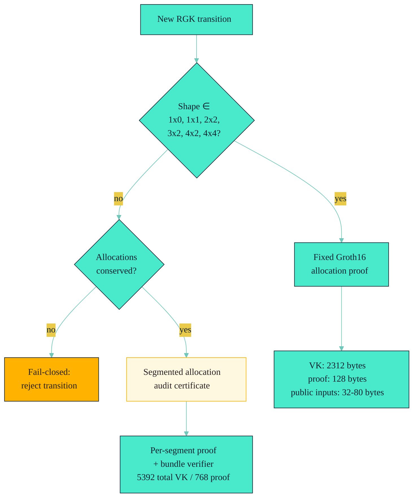
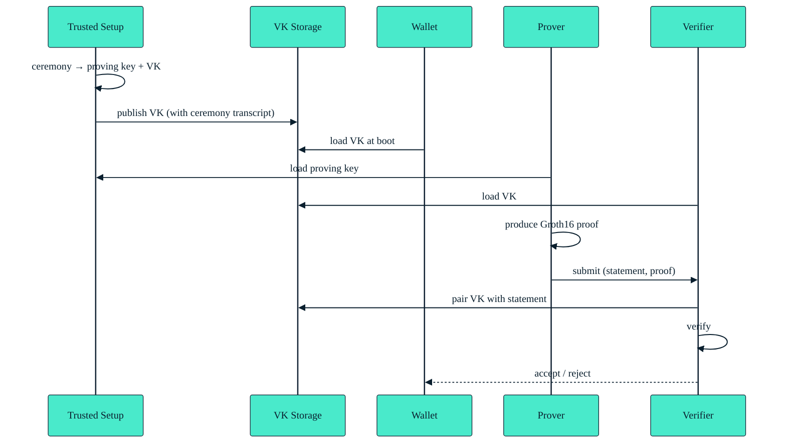

# Concepts / Production Allocation Strategy

!!! info "TL;DR"
    Three paths. **Fixed Groth16** is the hot path for `1x0, 1x1, 2x2, 3x2,
    4x2, 4x4` shapes (cost: ~2312 VK + 128-byte proof). **Segmented audit
    certificates** are the fallback for shapes > 4×4 (cost grows as
    `2*(spent+new) + 1 + spent*new`). **Fail-closed** rejects everything
    else. Never describe segmented audit as one recursive proof — until
    RGK has a native RISC0 prover, segmented audit is what we have.

> **Use fixed Groth16 allocation proofs whenever the transfer shape is one
> of the six supported shapes. Use segmented allocation-audit certificates
> for larger conserving full-state transfers. Never describe segmented
> audit as one recursive proof.**

This page ties together
[`docs/ZK-BOUNDARY.md` §Production Allocation-Proof Strategy](../../ZK-BOUNDARY.md),
[`docs/ZK-PROOF-PLAN.md`](../../ZK-PROOF-PLAN.md), and
[`docs/INTEGRATION.md` §Production Allocation Strategy](../../INTEGRATION.md)
into a single decision tree.

---

## The Decision Tree



Source: [`docs/ZK-PROOF-PLAN.md` §Proof Path Selector](../../ZK-PROOF-PLAN.md)
mermaid (the official version).

---

## Path 1: Fixed Groth16 (the hot path)

Use when the spent allocation count and the new allocation count match one
of the six supported shapes
([Glossary §Supported Allocation Shapes](../Glossary.md#supported-allocation-shapes)).

**Path:**

1. Build the `RgkContinuationPlan`.
2. Call `RgkContinuationPlan::into_production_zk_transfer_plan(self)`
   ([`crates/rgk-asset/src/native.rs:1490`](../../crates/rgk-asset/src/native.rs))
   to get an `RgkProductionZkTransferPlan`.
3. The plan carries a resolved `RgkAllocationProofShape` (one of the six).
4. Finalize as usual; the verifier emits a `Groth16PrecompileStack` via
   `real_zk::live_groth16_stack(&setup, &receipt)`
   ([`tests/rgk-e2e/tests/live_covenant.rs:653`](../../tests/rgk-e2e/tests/live_covenant.rs)).
5. The Toccata `OpZkPrecompile` consumes the proof at spend time.

**Cost snapshot** (from [`docs/ZK-PROOF-PLAN.md` §Current Cost Snapshot](../../ZK-PROOF-PLAN.md)):

| Surface | Public inputs | VK bytes | Proof bytes |
| --- | --- | --- | --- |
| Receipt statement | 232 (29 fields) | 2312 | 128 |
| Semantic transition | 512 (64 fields) | 2312 | 128 |
| `OneInOneOut` allocation | 32 (4 fields) | 2312 | 128 |
| `TwoInTwoOut` allocation | 64 (8 fields) | 2312 | 128 |
| `FixedAllocationVectorCircuit<SPENT, NEW>` | per-shape | 2312 | 128 |
| `OneInZeroOut` (terminal burn) | 0 | 2312 | 128 |

> **Rule:** the cost is the same for every fixed shape (Groth16 has a
> fixed proof size). Only the public-input length differs.

---

## Path 2: Segmented Audit Certificate (the fallback)

Use when the transfer shape is **larger than 4-in / 4-out** but still
conserves the asset's allocations. Examples:

- 5-in / 5-out full-state transfer.
- 8-in / 4-out fee consolidation.
- 4-in / 8-out payroll.

**Path:**

1. Build the `RgkContinuationPlan`.
2. Build an `RgkProductionAllocationStrategyPlan` with
   `ProductionAllocationProofStrategy::BoundedSupportedShapes` plus a
   list of segmented shapes
   ([`docs/INTEGRATION.md` §Production Allocation Strategy](../../INTEGRATION.md)).
3. Construct an `RgkProductionAllocationStrategyRecord`:
   ```rust
   // crates/rgk-asset/src/native.rs:998
   let record = RgkProductionAllocationStrategyRecord::new(plan.clone())?;
   let bytes = record.canonical_bytes()?;
   ```
4. The record carries:
   - The full transcript of segments.
   - Per-segment Groth16 proofs (each ≤ 4-in / 4-out).
   - Conservation proofs across segment boundaries.
   - Exclusion proofs that the same spent allocation isn't reused.
5. The indexer attaches the record via
   `apply_spend_with_continuation(...)` + the audit certificate store
   (`AllocationAuditCertificateStore`, [`crates/rgk-indexer/src/lib.rs:443`](../../crates/rgk-indexer/src/lib.rs)).

**Cost growth formula**
([`docs/ZK-PROOF-PLAN.md` §Segmented Audit Cost Growth](../../ZK-PROOF-PLAN.md)):

```text
entries = 2 * (spent_segments + new_segments) + 1 + spent_segments * new_segments
```

Where `spent_segments` and `new_segments` are the segment counts on each
side. The `+ spent_segments * new_segments` is the exclusion-grid cost.
For a 5-in / 5-out split as two stacked 4-in / 4-out transitions, this
gives `2 * (2 + 2) + 1 + 4 = 13` proof entries.

**Envelope format:**

| Field | Size |
| --- | --- |
| `rgk:zk:allocation-audit-certificate:v1` (full) | 5392 total VK / 768 proof / 11826 canonical bytes |
| `rgk:aac1` (compact) | smaller; for hot-path transfers |

---

## Path 3: Fail-Closed

Use when:

- The shape is not in the supported list **and** allocations are not
  conserved.
- The shape requires a proof that doesn't exist (e.g. unbounded
  allocation vector).
- The proof policy is unconstrained (`ImageIdPolicy::PolicyBranch([0;32])`
  or `AllowedSet([])`).

In all three cases, the transition is **rejected**. The verifier never
silently downgrades.

The relevant unit tests
([`crates/rgk-asset/src/native.rs`](../../crates/rgk-asset/src/native.rs)):

- `proof_policy_downgrade_is_rejected_by_state_digest`
- `unconstrained_image_id_is_rejected`
- `production_zk_transfer_plan_rejects_partial_previous_state_spend`
- `native_issue_rejects_supply_mismatch`
- `native_transition_rejects_supply_inflation_and_deflation`

---

## Production Budget Rules

The seven rules from
[`docs/ZK-PROOF-PLAN.md` §Production Budget Rules](../../ZK-PROOF-PLAN.md#production-budget-rules):

1. **Fixed Groth16 is the default for evidenced shapes.** Don't reach for
   segmented audit when a fixed shape works.
2. **Segmented audit must include a conservation proof per segment
   boundary.** Two adjacent segments that conserve separately may not
   conserve globally.
3. **A 1×0 burn is a fixed-shape proof, not segmented audit.** Terminal
   burn uses the same `OneInZeroOut` circuit.
4. **The witness txid must be bound into the segmented subproofs** —
   adversarial scenario P2 calls this out
   ([`docs/ADVERSARIAL-SCENARIOS.md` §P2](../../ADVERSARIAL-SCENARIOS.md)).
5. **No "recursive proof" claim.** Until RGK has a native RISC0 prover,
   segmented audit is what we have. Do not describe it as "one recursive
   proof."
6. **No `R0SuccinctPrecompileStack` on the hot path.** It is stack support
   only — see [`docs/ZK-BOUNDARY.md` §R0SuccinctPrecompileStack](../../ZK-BOUNDARY.md#r0succinctprecompilestack).
7. **Every proof claim is tied to a verifier + shape + cost budget + report line.**

---

## Verifier Key (VK) Governance

The VKs are pinned assets. Each VK corresponds to one (shape, image_id)
pair. Governance steps
([`docs/ZK-PROOF-PLAN.md` §Verifier Key Governance](../../ZK-PROOF-PLAN.md#verifier-key-governance)):



**Before mainnet:**

- Document each VK's source ceremony, transcript hash, and `image_id`.
- Pin VKs in the indexer config and the resolver config.
- Reject any receipt whose proof references an unknown VK.
- Reject any receipt whose statement claims a VK other than the one
  referenced.
- Document the cost budget per VK.
- Document the recovery path if a VK is later found insecure.

---

## What "Not Yet Proven" Means Here

From [`docs/ZK-BOUNDARY.md` §Not Yet Proven](../../ZK-BOUNDARY.md#not-yet-proven):

- Single recursive proof for arbitrary-size allocation vectors. Segmented
  audit is the current best.
- Native RISC0 prover and circuit family for RGK. `R0SuccinctPrecompileStack`
  is stack support only.
- Post-quantum Groth16 replacement.

For each "not yet," the wiki treats the absence as a launch-gate item,
not a hidden capability. See [Runbook / Launch Gates](../Runbook/Launch-Gates.md).

---

## Cross-references

- [`docs/ZK-BOUNDARY.md`](../../ZK-BOUNDARY.md) — statement sizes, circuit
  families.
- [`docs/ZK-PROOF-PLAN.md`](../../ZK-PROOF-PLAN.md) — cost table, decision
  rule, planning tracks.
- [`docs/INTEGRATION.md` §Production Allocation Strategy](../../INTEGRATION.md) —
  wallet-side integration.
- [`docs/ADVERSARIAL-SCENARIOS.md`](../../ADVERSARIAL-SCENARIOS.md) — S1-S4
  segmented audit scenarios, P1-P4 two-phase scenarios.
- [Glossary §Supported Allocation Shapes](../Glossary.md#supported-allocation-shapes).