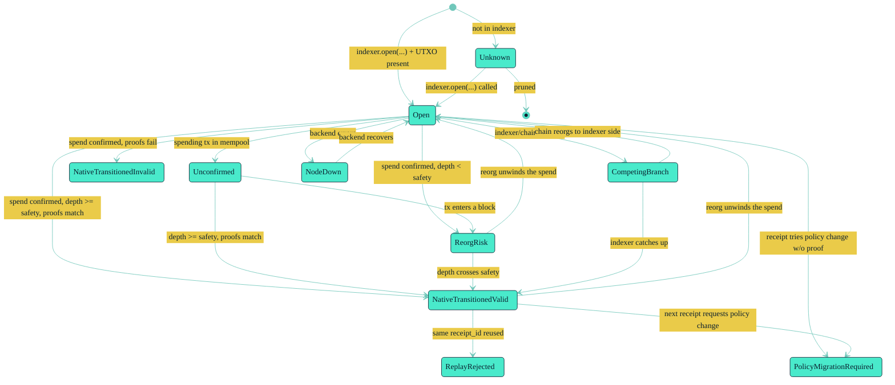

# Concepts / Resolver

> **The resolver is the native state machine that classifies every covenant
> into one of 13 hard-defined outcomes. There is no `OptimisticValid`. There
> is no `SoftInvalid`. Every variant means exactly one thing.**

This page explains the 13 `ResolverState` variants, when each fires, the
state transitions between them, and which entry point you call when.

---

## The 13 Variants

Source: [`crates/rgk-resolver/src/lib.rs:42-108`](../../crates/rgk-resolver/src/lib.rs).

| # | Variant | When it fires |
| --- | --- | --- |
| 1 | `Open { covenant, outpoint, state }` | Covenant is open in the indexer **and** the backend has a current UTXO. |
| 2 | `NativeTransitionedValid { covenant, spent_outpoint, new_outpoint, receipt_id, new_state, allocation_audit_certificate, confirmation_depth }` | Indexed spend observed on chain **and** `confirmation_depth >= reorg_safety_depth` **and** continuation proof matches the observed txid **and** policy migration (if any) is valid. |
| 3 | `NativeTransitionedInvalid { covenant, reason }` | Spend observed **but** receipt / continuation / migration proof failed structural checks. |
| 4 | `Unconfirmed { covenant, spending_txid }` | Spending tx is in mempool only, not yet in a block. |
| 5 | `ReorgRisk { covenant, daa_score }` | Spend is confirmed **but** `depth < reorg_safety_depth` (default `reorg_safety_depth = 10`). |
| 6 | `CompetingBranch { covenant, spent_outpoint, indexed_spending_txid, observed_spending_txid, observed_daa_score }` | Indexer and chain disagree on the spending txid. |
| 7 | `PolicyMigrationRequired { covenant, current_policy, requested_policy }` | Receipt attempts a policy change **without** a migration proof. |
| 8 | `ReplayRejected { covenant, receipt_id }` | Receipt id already accepted for this covenant. |
| 9 | `Unknown { covenant }` | Not indexed, or outpoint pruned. |
| 10 | `NodeDown { covenant, reason }` | Backend unreachable or returned an error. |
| 11-13 | (lane-level variants, see below) | `LaneResolverState`, `TransitionResolverState` for `lane`- and `transition_digest`-keyed lookups. |

`ResolverState::covenant(&self) -> KaspaCovenantId` is the safe accessor at
[`crates/rgk-resolver/src/lib.rs:111-124`](../../crates/rgk-resolver/src/lib.rs)
— every variant carries a `covenant` field. If you destructure the variant
yourself, beware: the `Unknown` variant returns `covenant: [0u8; 32]` when no
covenant matches (see [Drift Notes in the recon](../../recon/RECON-CODEBASE.md#drift-notes)
item #9). The accessor is always safe.

---

## State Machine



The arrows are illustrative, not formally proven — but every transition
corresponds to an `Index` or `Index`+`Spend` event in the source. The
single-test-per-state pattern is at
[`Tutorial-0: 10-Minute Fixture Walkthrough`](../Tutorials/Tutorial-0-10-Minute-Fixture-Walkthrough.md#step-3--see-every-resolver-state).

---

## Entry Points

| You want to ask… | Call | Returns | Source line |
| --- | --- | --- | --- |
| What is the state of covenant X? | `RgkResolver::resolve_by_covenant(covenant)` | `ResolverState` | `crates/rgk-resolver/src/lib.rs:191` |
| What is the state of asset Y? | `resolve_by_asset(asset_id)` | `ResolverState` (linear scan) | `crates/rgk-resolver/src/lib.rs:399` |
| What is the state of lane Z? | `resolve_lane(lane_id)` | `LaneResolverState` | `crates/rgk-resolver/src/lib.rs:412` |
| Can the holder of view_key V find their lane for asset Y at epoch E? | `resolve_by_view_key(view_key, asset_id, epoch)` | `LaneResolverState` | `crates/rgk-resolver/src/lib.rs:419` |
| What lane matches scan tag S? | `resolve_by_scan_tag(scan_tag)` | `LaneResolverState` | `crates/rgk-resolver/src/lib.rs:442` |
| Which public-lineage lanes exist for asset Y? | `resolve_public_lineage(asset_id)` | `Vec<LaneResolverState>` (filtered to `lane.public_lineage == true`) | `crates/rgk-resolver/src/lib.rs:451` |
| What is the state of transition_digest T? | `resolve_transition(transition_digest)` | `TransitionResolverState` | `crates/rgk-resolver/src/lib.rs:459` |
| Verify a receipt against the indexer? | `verify_receipt_against_indexer(covenant, receipt_bytes)` | `Result<RgkStateCommitment, ReceiptError>` | `crates/rgk-resolver/src/lib.rs:493` |

The full resolver struct:

```rust
// crates/rgk-resolver/src/lib.rs:170
pub struct RgkResolver<'a, B: KaspaChainBackend, I: Indexer> {
    pub backend: &'a B,
    pub indexer: &'a I,
    pub verifier_chain: KaspaChainId,
    pub reorg_safety_depth: u64,   // default 10
}
```

The simplest construction
([`crates/rgk-resolver/src/lib.rs:180`](../../crates/rgk-resolver/src/lib.rs)):

```rust
let r = RgkResolver::new(&backend, &idx, KASPA_LOCAL_TOCCATA);
```

In production, `reorg_safety_depth` is set higher (e.g. 100 on testnet,
Kaspa's default on mainnet) but the default of 10 is fine for fixtures and
tests.

---

## Worked Example 1 — `Open`

The canonical test
([`crates/rgk-resolver/src/lib.rs:740`](../../crates/rgk-resolver/src/lib.rs)):

```rust
#[test]
fn open_when_indexed_and_utxo_present() {
    let mut backend = FixtureBackend::new(KASPA_LOCAL_TOCCATA);
    let mut idx = InMemoryIndexer::new();
    let cov = b32("1111111111111111111111111111111111111111111111111111111111111111");
    let lin = b32("aaaaaaaaaaaaaaaaaaaaaaaaaaaaaaaaaaaaaaaaaaaaaaaaaaaaaaaaaaaaaaaa");
    let open = KaspaOutpoint { transaction_id: [1u8; 32], index: 0 };
    idx.open(KASPA_LOCAL_TOCCATA, cov, lin, sample_state(cov, 1, asset_id), open, 10).unwrap();
    backend.add_utxo_at(10, test_utxo(open, 1000, 10));
    let r = RgkResolver::new(&backend, &idx, KASPA_LOCAL_TOCCATA);
    let st = r.resolve_by_covenant(cov);
    match st {
        ResolverState::Open { covenant, outpoint, .. } => { /* assert */ }
        _ => panic!("expected Open, got {:?}", st),
    }
}
```

What happened:

1. The indexer was told the covenant is open at outpoint `([1u8;32], 0)`.
2. The backend was told the same outpoint has a UTXO at DAA score 10.
3. The resolver returned `Open { covenant, outpoint, state }`.

If the UTXO were missing, you'd get `Unknown { covenant }`.

---

## Worked Example 2 — `NativeTransitionedValid`

The fixture e2e flow ([`tests/rgk-e2e/src/lib.rs:471`](../../tests/rgk-e2e/src/lib.rs))
walks through the full path. The relevant indexer call:

```rust
// tests/rgk-e2e/src/lib.rs:657
idx.apply_spend_with_continuation(
    covenant_id,
    receipt_id,
    open_outpoint,
    new_outpoint,
    new_rgk_state.clone(),
    2,                       // <-- daa_score of the spending block
    ContinuationProof {
        commitment: native_transition_report.continuation_commitment.to_bytes(),
        shape_root: native_transition_report.continuation_shape_root.to_bytes(),
        transition_digest: native_transition_report.transition_digest.to_bytes(),
    },
)
.map_err(|e| format!("apply_spend: {e}"))?;
```

After this, with `reorg_safety_depth = 1`, the resolver returns
`NativeTransitionedValid`. The variant carries:

- `covenant` — the covenant id.
- `spent_outpoint` — the open outpoint.
- `new_outpoint` — the continuation outpoint.
- `receipt_id` — the receipt that authorised this transition.
- `new_state` — the post-transition `RgkStateCommitment`.
- `allocation_audit_certificate` — if the policy required it; otherwise `None`.
- `confirmation_depth` — `depth = current_daa - spending_daa`.

---

## Worked Example 3 — `ReplayRejected`

This fires when the same `receipt_id` is presented for the same covenant
twice. The indexer's replay set enforces it. The receipt verifier on the
local side (no indexer) does **not** check replays — only the indexer-aware
`verify_receipt_against_indexer` does.

To produce `ReplayRejected` in a test, call `apply_spend` twice with the
same `receipt_id`. The second call should fail with `ReplayRejected`.

---

## Worked Example 4 — `PolicyMigrationRequired`

Fires when a receipt attempts to change the proof policy **without**
providing a `PolicyMigrationProof`. The wallet must:

1. Build a `PolicyMigrationInput` with the old and new policy.
2. Call `build_policy_migration_proof(...)`.
3. Pass the resulting `PolicyMigrationProof` to
   `apply_spend_with_continuation_and_policy_migration(...)` on the indexer.

See [`docs/INTEGRATION.md` §Policy Migration](../../INTEGRATION.md) for
the full procedure and the `RgkProofPolicy::commitment()` integration.

---

## Worked Example 5 — `CompetingBranch`

The hardest state to fire: it requires the indexer to have indexed one
spending txid while the chain shows a different one. In practice this
happens when:

- A reorg replaced the spending block with another block spending the same
  covenant output.
- The indexer hasn't been re-scanned past the reorg boundary.

To reproduce in a fixture test:

```rust
// pseudocode
idx.open(...);
backend.add_spending_tx(...);
let st1 = resolver.resolve_by_covenant(cov);     // NativeTransitionedValid
backend.replace_with_competing_spend(...);      // different txid, same spent outpoint
let st2 = resolver.resolve_by_covenant(cov);     // CompetingBranch
```

The competing-branch detector is at
[`crates/rgk-resolver/src/lib.rs`](../../crates/rgk-resolver/src/lib.rs)
(search `CompetingBranch` in the file).

---

## What the Resolver Does NOT Return

Three things are deliberately **not** in the state machine:

1. **`OptimisticValid`** / **`SoftInvalid`** — there is no "pending" state.
   Either the proofs match, or they don't.
2. **`Replayed`** / **`DoubleSpent`** as separate variants — these collapse
   into `ReplayRejected` and `CompetingBranch`.
3. **`UnknownChain`** — chain-domain mismatch is enforced upstream at
   `ReceiptInput::new` (`crates/rgk-receipt/src/lib.rs:115-137`), so the
   resolver never sees it.

This is a design rule, not a missing enum variant. Any tutorial that
introduces a "pending" state is a misunderstanding.

---

## Cost Budget

The resolver only classifies after bounded local checks
([`docs/VERIFICATION-BUDGET.md` §Resolver Budget](../../VERIFICATION-BUDGET.md)):

1. Covenant is in the indexer → `lookup(covenant)` is O(log n).
2. Backend has the spent outpoint's spending tx → `get_utxo(...)` O(1).
3. Spending tx's confirmation depth ≥ `reorg_safety_depth`.
4. Receipt and continuation proof pass `verify_local`-style structural
   checks (no ZK proving work here; that is the verifier's job).
5. Receipt id is not in the indexer's replay set.

If any of these fails, the resolver returns one of the negative variants
above. No expensive work is done before classification.

---

## Cross-references

- [`docs/ARCHITECTURE.md` §Resolver States](../../ARCHITECTURE.md).
- [`docs/SECURITY.md` §Resolver Classifications](../../SECURITY.md) — the
  security-flavored version of the same list.
- [`docs/INTEGRATION.md` §Private Lane Discovery](../../INTEGRATION.md) —
  how wallet code calls these entry points.
- [Tutorial-2: Build, Verify, and Resolve a Receipt](../Tutorials/Tutorial-2-Receipts.md).
- [Tutorial-0 §Step 3 — See every resolver state](../Tutorials/Tutorial-0-10-Minute-Fixture-Walkthrough.md#step-3--see-every-resolver-state).