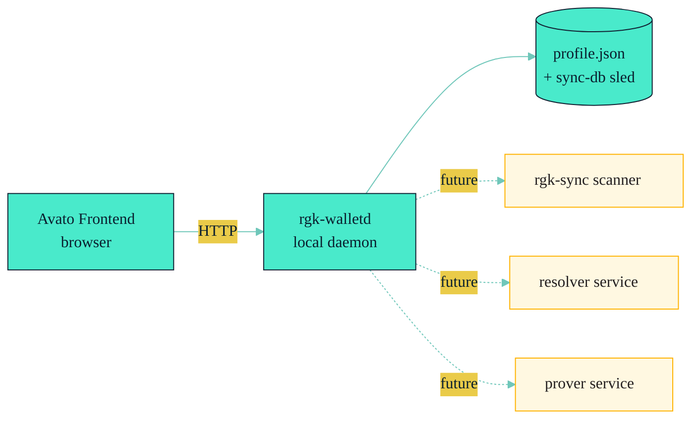

# Concepts / Walletd Boundary

> **`rgk-walletd` is a local HTTP boundary, not a node, not a wallet
> backend, not a prover service.** This page spells out what is in scope
> today and what is explicitly out of scope.

The canonical source for this page is
[`docs/AVATO-WALLETD.md`](../../AVATO-WALLETD.md). The drift note
([`recon/RECON-COCDEBASE.md`](../../recon/RECON-CODEBASE.md) §drift #11)
flags that `rgk-walletd` is a single `main.rs` with no `lib.rs` — it
cannot be embedded as a library; the only way to talk to it is HTTP via
the axum router.

---

## What It Is

A non-custodial local daemon:

- The Avato browser frontend talks to it via HTTP.
- It owns local profile state (JSON file under `RGK_WALLETD_STATE`).
- It handles health checks, lock/unlock, and (forward) handoff to
  scanner/resolver/prover services.



The dashed lines are the **future handoff** (the current implementation
calls into the underlying `rgk-sync` / `rgk-resolver` / `rgk-zk` crates
directly, not separate services). See the drift note below.

---

## The 11 Endpoints

Source: [`crates/rgk-walletd/src/main.rs:625`](../../crates/rgk-walletd/src/main.rs).

| Method | Path | Purpose |
| --- | --- | --- |
| `GET` | `/health` | Liveness check. |
| `GET` | `/wallet/profile` | Read-only profile metadata (no secrets). |
| `POST` | `/wallets` | Create a new wallet profile. |
| `POST` | `/wallet/import` | Import an existing wallet. |
| `POST` | `/wallet/lock` | Lock the in-memory identity vault. |
| `POST` | `/wallet/unlock` | Unlock with passphrase. |
| `POST` | `/wallet/kaspa-endpoint` | Update the Kaspa node endpoint. |
| `POST` | `/wallet/sync` | Drive one `rgk-sync` tick; re-resolves dashboard lanes. |
| `GET` | `/dashboard` | Aggregated dashboard view (lanes, proofs, transitions). |
| `POST` | `/lanes` | Register a new lane (metadata-only or full-evidence bundle). |
| `POST` | `/proofs` | Stage a proof as `pending`; mark `verified` after verification. |
| `POST` | `/transitions` | Wallet-built receipt path. |

The canonical contract verifier is:

```bash
bash scripts/verify-avato-walletd-contract.sh
```

This spins up the daemon, then a Python harness hits every endpoint and
asserts strict 4xx semantics for malformed inputs.

---

## The Two Modes of `/lanes`

The `/lanes` endpoint has two modes
([`docs/AVATO-WALLETD.md`](../../AVATO-WALLETD.md)):

1. **Metadata-only** — frontend registers a lane with just `lane_id`,
   `scan_tag`, `asset_id`, `covenant_id`. The daemon stores it as
   `unknown`.
2. **Full-evidence bundle** — frontend provides a `RgkTransitionReport`
   + `ContinuationProof`. The daemon verifies, attaches to the lane, and
   marks the lane `known`.

The first mode is for new issues; the second is for ingesting existing
transitions. Both go through the resolver before being marked
`NativeTransitionedValid`.

---

## What's NOT in `rgk-walletd` Today

The drift note
[`recon/RECON-CODEBASE.md`](../../recon/RECON-CODEBASE.md) item #11 and the
[`docs/AVATO-WALLETD.md`](../../AVATO-WALLETD.md) status paragraph
explicitly say: lanes and receipt evidence appear only after explicit
wallet actions or future scanner/resolver/prover integration.

Specifically, **`rgk-walletd` does not**:

- Run its own Kaspa node. It connects to one via `--kaspa-endpoint` or
  `RGK_LIVE_KASPA_URL`.
- Persist private keys, recovery phrases, or passphrases to disk. The
  JSON state file contains public profile metadata only; secrets live in
  the encrypted identity vault (Argon2id + XChaCha20-Poly1305) which is
  held in memory while unlocked.
- Auto-discover new lanes. Lanes are registered explicitly via
  `/lanes` or `rgk-sync` (which `/wallet/sync` calls once per tick).
- Auto-stage proofs. Proofs come from the wallet's prover client or from
  the frontend's manual staging.
- Sign transactions. The wallet frontend (Avato) signs; the daemon
  persists the unsigned transaction envelope via `/transitions`.
- Expose `StealthLane`. The `PrivacyMode` enum at
  [`crates/rgk-walletd/src/main.rs:312`](../../crates/rgk-walletd/src/main.rs)
  is a strict subset of `LanePrivacyPolicy` — only `PrivateLane` and
  `PublicLineage`.

> **Tutorial rule:** do not advertise `rgk-walletd` as production-ready.
> The integration is partial; treat it as a usable dev/test boundary.

---

## Network Prefixes and Chain Domains

The daemon refuses to accept a frontend-selected chain domain that
differs from its configured `--network`. From
[`docs/AVATO-WALLETD.md`](../../AVATO-WALLETD.md):

| `--network` | Address prefix | Chain domain |
| --- | --- | --- |
| `mainnet` | `kaspa:` | `kaspa-mainnet` |
| `testnet-10` | `kaspatest:` | `kaspa-testnet-10` |
| `testnet-12` | `kaspatest:` | `kaspa-testnet-12` |
| `devnet` | `kaspadev:` | `kaspa-devnet` |
| `simnet` | `kaspasim:` | `kaspa-simnet` |
| `local-toccata` | `kaspasim:` (simnet) | `kaspa-local-toccata` |

The chain domain is **not** a display label — it is enforced.

---

## CLI Flags and Env Vars

```bash
cargo run -p rgk-walletd -- \
    --listen 127.0.0.1:8788 \
    --network local-toccata \
    --state target/rgk-walletd/state.json \
    --sync-db target/rgk-walletd/sync-db \
    --kaspa-endpoint ws://127.0.0.1:18111/v2/kaspa/simnet/no-tls/wrpc/borsh
```

| Flag | Env | Default |
| --- | --- | --- |
| `--listen <addr>` | `RGK_WALLETD_LISTEN` | `127.0.0.1:8788` |
| `--network <kind>` | `RGK_WALLETD_NETWORK` | `local-toccata` |
| `--state <path>` | `RGK_WALLETD_STATE` | `target/rgk-walletd/state.json` |
| `--sync-db <path>` | `RGK_SYNC_DB` | `target/rgk-walletd/sync-db` |
| `--kaspa-endpoint <url>` | `RGK_LIVE_KASPA_URL` | network default |

The frontend launch is:

```bash
VITE_RGK_API_BASE_URL=http://127.0.0.1:8788 pnpm dev:rgk
```

---

## Lock / Unlock Cycle

The daemon has a clean lock/unlock cycle:

- `POST /wallet/lock` clears the in-memory identity vault and marks
  `identityVaultStatus = locked`.
- `POST /wallet/unlock` re-derives the vault key from the passphrase
  (Argon2id) and decrypts the XChaCha20-Poly1305 vault. The daemon returns
  to `identityVaultStatus = ready`.
- A daemon restart drops the in-memory state. The next request sees
  `identityVaultStatus = encrypted` until `/wallet/unlock` is called.

The wallet profile **address** (not the secret key) is in the public
profile metadata and survives restart. Secrets never appear in the JSON
state file.

---

## Cross-references

- [`docs/AVATO-WALLETD.md`](../../AVATO-WALLETD.md) — the canonical doc.
- [`Tutorial-5: Operate rgk-walletd`](../Tutorials/Tutorial-5-Operate-Walletd.md)
  — the runnable walkthrough.
- [Concepts / Privacy](./Privacy.md) — the `PrivacyMode` subset.
- [`scripts/verify-avato-walletd-contract.sh`](../../scripts/verify-avato-walletd-contract.sh) —
  the contract verifier.