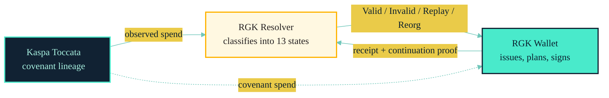

# Tutorial 1 — What RGK Actually Is

> **Read time:** ~20 minutes. **No code required.** This is the philosophy
> layer; it explains *why* RGK is shaped the way it is.

The long-form narrative is at
[`Quant Dev / INTRODUCTION.md`](https://github.com/a19q3/quant-dev/blob/main/INTRODUCTION.md)
(1160 lines, 14 diagrams). This wiki page is a 20-minute summary that
gives you the spine.

---

## The 30-Second Pitch

RGK is an asset system on Kaspa Toccata where:

1. The chain only proves **that** a covenant was spent in the right shape.
2. The wallets prove **what** that spend means for the asset.
3. Identity is the **covenant lineage**, not an external contract id.
4. Privacy is the **default**, not an opt-in flag.

That is it. Everything else is detail.

---

## The Problem

Most "tokens on a chain" today come in two flavours:

| Style | What lives on-chain | Cost | Privacy |
| --- | --- | --- | --- |
| Smart-contract token (ERC-20) | Every balance, every transfer rule, every owner | Every node stores and re-executes everything | Public by default |
| Embedded token (colored coins) | Asset data jammed into tx outputs | The chain becomes a slow database | Public by default |

RGK asks a different question:

> *What if the chain only had to prove that a covenant UTXO was spent in
> the right shape — and let the wallets figure out what the spend means
> for their private asset?*

This is **client-side validation** (CSV). RGK is the native Kaspa
implementation of CSV with covenants.

---

## The Three Ideas

| Idea | What it means |
| --- | --- |
| **Lineage identity** | The asset's real identity is the covenant lineage, not an external contract id. Two issues with the same `asset_id` but different genesis outpoints have different `lineage_id`s. |
| **Client-side validation** | Asset state is validated by wallets, not reconstructed from chain data alone. |
| **Receipt-bound covenants** | A typed receipt binds the asset transition to the covenant spend on chain. The receipt is the bridge between wallet-side state and chain-side proof. |

The intuition:

The chain is the **notary**. The wallet is the **judge**.

---

## RGB vs RGK (10-second cousin-map)

If you have heard of RGB on Bitcoin / Liquid, RGK is its **spiritual
cousin**, but:

| Axis | RGB | RGK |
| --- | --- | --- |
| Settlement substrate | Bitcoin / Liquid (multi-protocol stack: single-use seals, opret/tapret, aluvm, etc.) | Kaspa Toccata (covenant-native) |
| Canonical identity | Genesis + transition graph (seal-based) | **Covenant lineage** (covenant-native) |
| Continuation model | Single-step (or multi-step via consignment) | **Two-phase** (plan → finalize) |
| Receipts | Consignment + transfer proof | **Typed `RgkReceipt`** with hash-bound identity |
| Resolver | Not a single canonical state machine; recipient validates then accepts consignment | **Native 13-state resolver** that classifies every covenant continuously |
| Privacy | Public on Bitcoin / Liquid by default | **Private by default** (PublicLineage is opt-in) |
| Channel posture | RGB-LN exists, but each hop carries full RGB state | **Target: RGK + Kurrent channels**, no full state per hop (see Quant Dev §15) |
| Throughput | Bound by L1 throughput + consignment size | Bound by Kaspa block rate; small per-covenant footprint |

The architectural posture is the same (chain-as-notary, wallet-as-judge),
but the on-chain primitives and the resolution model are Kaspa-native.

---

## The Six Properties (one per sentence)

1. **Tiny on-chain footprint.** Each covenant output is one small payload —
   `tag | version | chain_id | lineage_id | asset_id | state_digest | policy | mode | replay_marker`.
2. **Privacy by default.** Outside observers see commitments, not plaintext
   amounts, owners, or proof policies.
3. **Lineage is identity.** `asset_id` is a wallet-friendly label;
   `lineage_id` is the on-chain identity. You can fake the label; you
   cannot forge the lineage.
4. **Two-phase continuation.** The wallet commits to the next output
   shape *before* the future txid exists. See [Concepts / Continuation](../Concepts/Continuation.md).
5. **Resolver gives a named verdict, not a binary.** 13 hard outcomes;
   every one means one specific thing. See [Concepts / Resolver](../Concepts/Resolver.md).
6. **Receipts are typed, not signatures.** `RgkReceipt` is a 32-byte
   commitment to a typed statement. The proof is separate. See
   [Reference / Receipt Spec](../Reference/Receipt-Spec.md).

---

## Where To Go From Here

| You want to… | Go to |
| --- | --- |
| Read the long-form philosophy | [`Quant Dev / INTRODUCTION.md`](https://github.com/a19q3/quant-dev/blob/main/INTRODUCTION.md) (1160 lines, 14 diagrams) |
| Run something in 10 minutes | [Tutorial-0: 10-Minute Fixture Walkthrough](./Tutorial-0-10-Minute-Fixture-Walkthrough.md) |
| Understand lineage identity in depth | [Concepts / Identity](../Concepts/Identity.md) |
| Understand the two-phase continuation | [Concepts / Continuation](../Concepts/Continuation.md) |
| Understand the 13-state resolver | [Concepts / Resolver](../Concepts/Resolver.md) |
| Understand the privacy posture | [Concepts / Privacy](../Concepts/Privacy.md) |
| See why 32 bytes is not arbitrary | [Concepts / Bounded Objects](../Concepts/Bounded-Objects.md) |
| Build a receipt in code | [Tutorial-2](./Tutorial-2-Receipts.md) |
| Integrate a wallet | [Tutorial-3](./Tutorial-3-Integrate-A-Wallet.md) |
| Read the spec | [Reference / Covenant Spec](../Reference/Covenant-Spec.md), [Reference / Receipt Spec](../Reference/Receipt-Spec.md), [Reference / Lane Calculus](../Reference/Lane-Calculus.md) |