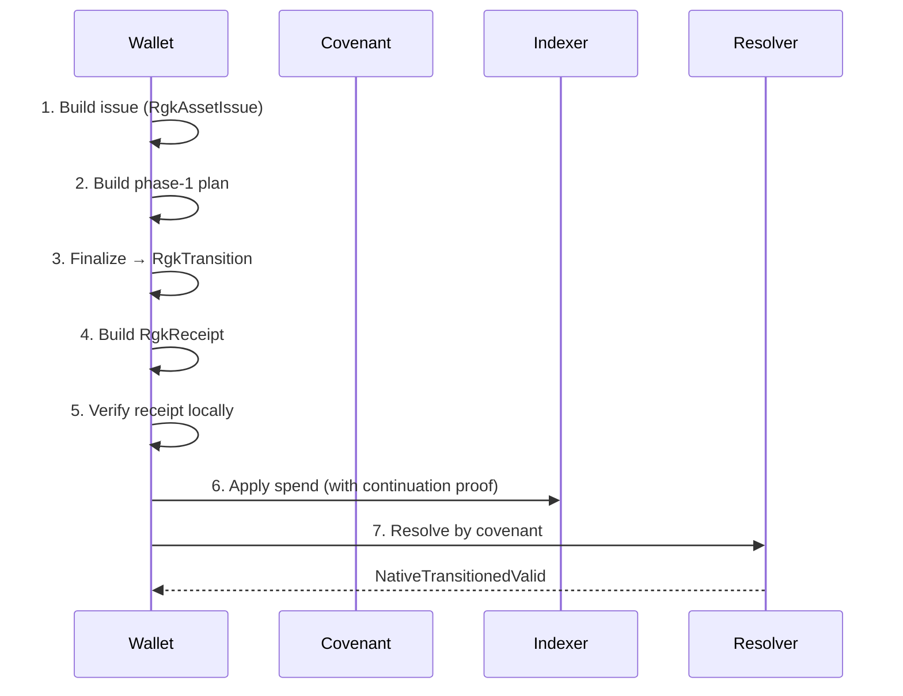

# Tutorial 2 — Build, Verify, and Resolve a Receipt

> **Read time:** ~30 minutes. **Runnable.** You will build a phase-1 plan,
> finalize it as a transition, build the `RgkReceipt`, verify it locally,
> then resolve it against the indexer.

This tutorial is the canonical "issuance → receipt → resolver"
walkthrough. It is the smallest end-to-end story that touches every layer
of the architecture.

---

## Prerequisites

- You have run [Tutorial-0](./Tutorial-0-10-Minute-Fixture-Walkthrough.md)
  at least once.
- You have read [Concepts / Continuation](../Concepts/Continuation.md) and
  [Concepts / Resolver](../Concepts/Resolver.md).
- `cargo test -p rgk-e2e --lib fixture_e2e_passes` passes.

---

## The 7 Steps



Each step has a `file:line` reference so you can read the original source.

---

## Step 1 — Build the Issue

Source: [`crates/rgk-asset/src/native.rs:3379-3411`](../../crates/rgk-asset/src/native.rs).

```rust
use rgk_asset::native::{RgkAssetIssue, RgkAssetIdDerivation, RgkAllocation};
use rgk_asset::lanes::{LanePrivacyPolicy, BlindedLaneId};
use rgk_asset::commitments::{RgkMetadataCommitment, RgkOwnerCommitment};
use rgk_core::chain::KASPA_LOCAL_TOCCATA;

fn issue_with_allocations(
    total_supply: u64,
    allocations: Vec<RgkAllocation>,
) -> RgkAssetIssue {
    let schema_id = *b"rgk:asset:schema:v1_____________";
    let policy = proof_policy();                 // RgkProofPolicy::VerifierReceipt { verifier_key_hash: [0x91; 32] }
    let asset_id = RgkAssetIssue::derive_asset_id(RgkAssetIdDerivation {
        chain: KASPA_LOCAL_TOCCATA,
        schema_id,
        total_supply,
        metadata_commitment: metadata_commitment(),
        owner_commitment: owner_commitment(),
        allocations: &allocations,
        lane_id: lane_id(),
        privacy_policy: LanePrivacyPolicy::PrivateLane,
        proof_policy: &policy,
    })
    .unwrap();
    RgkAssetIssue {
        chain: KASPA_LOCAL_TOCCATA,
        schema_id, asset_id, total_supply,
        metadata_commitment: metadata_commitment(),
        owner_commitment: owner_commitment(),
        allocations,
        lane_id: lane_id(),
        privacy_policy: LanePrivacyPolicy::PrivateLane,
        proof_policy: policy,
    }
}
```

What you just did:

- Picked `LanePrivacyPolicy::PrivateLane` (the default).
- Committed to a `RgkProofPolicy::VerifierReceipt { verifier_key_hash }`.
- Derived the `asset_id` from supply + commitments + allocations + lane +
  privacy + proof policy.
- Stored the result in an `RgkAssetIssue`.

The `RgkAssetIssue::validate()` call is what you'd run next to assert
structure. `RgkAssetIssue::validate_for_production_zk()` is the stricter
gate that requires allocations to fit a supported ZK shape
(`RGK_ALLOCATION_STRATEGY_ZK_MAX_SPENT = 4`).

---

## Step 2 — Build the Phase-1 Plan

Source: [`crates/rgk-asset/src/native.rs:3464-3484`](../../crates/rgk-asset/src/native.rs).

```rust
use rgk_asset::native::RgkContinuationPlan;

fn continuation_plan() -> RgkContinuationPlan {
    let issue = issue();
    let previous_report = issue.validate().unwrap();
    RgkContinuationPlan {
        chain: issue.chain,
        schema_id: issue.schema_id,
        asset_id: issue.asset_id,
        total_supply: issue.total_supply,
        metadata_commitment: issue.metadata_commitment,
        previous_owner_commitment: issue.owner_commitment,
        new_owner_commitment: issue.owner_commitment,
        ownership_authorization_commitment: [0; 32],
        previous_state_digest: previous_report.state_digest,
        spent_allocations: issue.allocations,
        new_allocation_shapes: continuation_shapes(),     // Vec<RgkContinuationAllocationShape>
        burn: None,
        lane_id: issue.lane_id,
        privacy_policy: issue.privacy_policy,
        proof_policy: issue.proof_policy,
    }
}
```

Notice `new_allocation_shapes: Vec<RgkContinuationAllocationShape>` — these
are **shapes**, not full allocations. The phase-1 plan does not yet know
the witness txid.

Call `RgkContinuationPlan::validate()` to get the
`RgkContinuationCommitment` (the phase-1 commitment that gets baked into
the covenant script as a witness element and into the receipt).

```rust
let phase1_report = plan.validate().unwrap();
let commitment: RgkContinuationCommitment = phase1_report.commitment;
```

The commitment is **stable** across re-plans. You can call `validate()`
twice and get the same commitment.

---

## Step 3 — Finalize (phase 2)

Source: [`crates/rgk-asset/src/native.rs:4670-4696`](../../crates/rgk-asset/src/native.rs).

After the wallet has signed and broadcast the spend, the txid exists. Now
you can finalize:

```rust
let finalized: RgkFinalizedContinuation = plan
    .finalize(witness_txid, daa_score, confirmation_depth)
    .unwrap();

let transition: &RgkTransition = &finalized.transition;
let transition_digest: RgkTransitionDigest = finalized.transition_report.transition_digest;
```

The phase-2 `RgkTransition` carries `new_allocations: Vec<RgkAllocation>`
where each allocation's `RgkCovenantAnchor.covenant_outpoint.transaction_id
== witness_txid`. The `transition_digest` is the value the receipt must
match.

For production-ZK, you can also call
`RgkContinuationPlan::into_production_zk_transfer_plan(self)` at
[`crates/rgk-asset/src/native.rs:1490`](../../crates/rgk-asset/src/native.rs)
to wrap the plan in a `RgkProductionZkTransferPlan`.

---

## Step 4 — Build the Receipt

Source: [`tests/rgk-e2e/src/lib.rs:600-612`](../../tests/rgk-e2e/src/lib.rs).

```rust
use rgk_receipt::{ReceiptInput, ReceiptBuilder};
use rgk_core::commit::{sha256_digest, replay_nonce};
use rgk_core::types::ProofMode;

let receipt_input = ReceiptInput::new(
    chain,
    covenant_id,
    initial_rgk_state.clone(),
    new_rgk_state.clone(),
    native_transition_report.transition_digest.to_bytes(),
    native_transition_report.continuation_commitment.to_bytes(),
    ProofMode::VerifierReceipt,
    replay_nonce(   // <-- derives the per-spend nonce; never reuse
        &[covenant_id, witness_txid].concat(),
        &native_transition_report.transition_digest.to_bytes(),
    ),
)
.map_err(|e| format!("ReceiptInput: {e:?}"))?;

let (receipt, receipt_id, receipt_bytes) = ReceiptBuilder::build(&receipt_input)
    .map_err(|e| format!("ReceiptBuilder: {e:?}"))?;
```

What you just did:

- Built a `ReceiptInput` with the chain id, covenant id, old + new state,
  transition digest, continuation commitment, proof mode, replay nonce.
- Called `ReceiptBuilder::build` which returns the receipt, its
  `ReceiptId` (32-byte hash commitment), and the canonical wire bytes.

> **Note.** The `ReceiptId` is **derived**, not chosen. Calling
> `receipt_commitment(&receipt) -> Bytes32` always gives the same id for
> the same canonical bytes.

---

## Step 5 — Verify the Receipt Locally

Source: [`crates/rgk-receipt/src/lib.rs:192-205`](../../crates/rgk-receipt/src/lib.rs).

```rust
use rgk_receipt::ReceiptVerifier;

let verified_id: ReceiptId = ReceiptVerifier::verify_local(
    &receipt_bytes,
    expected_covenant_id,
    expected_old_state,
    verifier_chain,
)?;
```

The local verifier is **pure-structural** — no indexer, no `no_std`-hostile
dependencies. Use it for embedded / mobile / hardware-wallets. The
9-bullet structural invariants it enforces are listed in
[Reference / Receipt Spec](../Reference/Receipt-Spec.md).

---

## Step 6 — Apply the Spend to the Indexer

Source: [`tests/rgk-e2e/src/lib.rs:657-670`](../../tests/rgk-e2e/src/lib.rs).

```rust
use rgk_indexer::ContinuationProof;

idx.apply_spend_with_continuation(
    covenant_id,
    receipt_id,
    open_outpoint,
    new_outpoint,
    new_rgk_state.clone(),
    2,                                          // daa_score of the spending block
    ContinuationProof {
        commitment: native_transition_report.continuation_commitment.to_bytes(),
        shape_root: native_transition_report.continuation_shape_root.to_bytes(),
        transition_digest: native_transition_report.transition_digest.to_bytes(),
    },
)
.map_err(|e| format!("apply_spend: {e}"))?;
```

What you just did:

- Recorded the spend in the indexer's `IndexedCovenant.spend_history`.
- Stored the `ContinuationProof` so the resolver can verify the proof
  txid against the observed spend.
- Bound the receipt id into the replay set.

---

## Step 7 — Resolve by Covenant

Source: [`crates/rgk-resolver/src/lib.rs:191`](../../crates/rgk-resolver/src/lib.rs).

```rust
use rgk_resolver::{RgkResolver, ResolverState};

let mut resolver = RgkResolver::new(backend, &idx, KASPA_LOCAL_TOCCATA);
resolver.reorg_safety_depth = 1;   // fixture; production default is 10
let st = resolver.resolve_by_covenant(covenant_id);
```

After the spend is at depth ≥ `reorg_safety_depth`, the resolver returns:

```rust
ResolverState::NativeTransitionedValid {
    covenant,
    spent_outpoint: open_outpoint,
    new_outpoint,
    receipt_id,
    new_state: new_rgk_state,
    allocation_audit_certificate: None,
    confirmation_depth: 1,
}
```

This is the "happy path" verdict. See [Concepts / Resolver](../Concepts/Resolver.md)
for the other 12 states.

---

## Putting It All Together

The full path lives in the e2e harness at
[`tests/rgk-e2e/src/lib.rs:471`](../../tests/rgk-e2e/src/lib.rs) — the
function `rgk_e2e::run_e2e_fixture`. Read it top-to-bottom and you will
see the exact same 7 steps in production-grade code.

The summary output (printed via the `RGK e2e summary` block) is the
canonical observable of a successful run. Format:

```text
RGK e2e summary
  chain:           KaspaLocalToccata
  covenant:        0x…
  lineage:         0x…
  asset:           0x…
  old_state:       0x…
  new_state:       0x…
  receipt_id:      0x…
  proof_mode:      verifier-receipt
  policy:          any
  transitions:     1
  resolver:        Open { … } | NativeTransitionedValid { … } | ReorgRisk { … }
  live_mode:       false
```

---

## What Could Go Wrong

| Symptom | Cause | Fix |
| --- | --- | --- |
| `Err(ReusedSpentAnchor)` at finalize. | The phase-1 plan tried to reuse the spent outpoint's txid as a future continuation output. | Adjust the new allocation shapes so they don't collide with the spent anchor. |
| `Err(SupplyMismatch)` at issue / validate. | `sum(allocations[].amount) != total_supply`. | Recompute the allocations or supply. |
| `ResolverState::NativeTransitionedInvalid { reason }`. | Receipt or continuation proof failed structural checks. | Check the receipt invariants and the continuation commitment binding. |
| `ResolverState::ReplayRejected { receipt_id }`. | The same receipt id was already accepted for this covenant. | Re-derive the receipt (the id is hash-bound; you cannot reuse). |
| `ResolverState::ReorgRisk`. | `depth < reorg_safety_depth`. | Wait. In tests, set `reorg_safety_depth = 1`. |

---

## Cross-references

- [Concepts / Continuation](../Concepts/Continuation.md) — the two-phase
  model in depth.
- [Concepts / Resolver](../Concepts/Resolver.md) — the 13-state machine.
- [Concepts / Bounded Objects](../Concepts/Bounded-Objects.md) — the
  32-byte invariants.
- [Concepts / Identity](../Concepts/Identity.md) — `asset_id` derivation.
- [Reference / Receipt Spec](../Reference/Receipt-Spec.md) — the 9
  invariants.
- [Tutorial-3: Integrate a Wallet](./Tutorial-3-Integrate-A-Wallet.md) —
  the production-side version of these 7 steps.